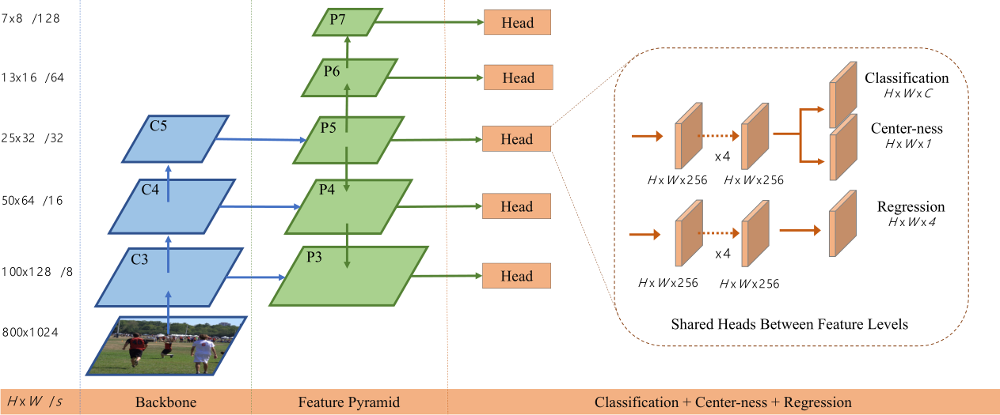
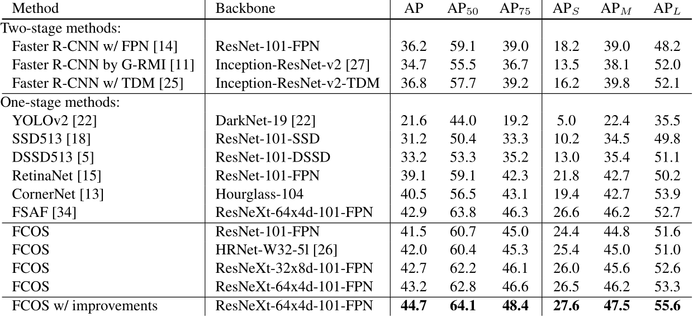

# 一，论文翻译

## 摘要
本文提出了一种类似语义分割基于像素级的、一阶段全卷积目标检测网络。当前，几乎所有的一阶段网络，诸如RetinaNet，SSD，YOLOv3或者Faster RCNN等都是基于anchor的，本文是anchor-free的，也是proposal-free的。所以，不需要预定义anchor，FCOS也避免了所有与anchor相关的运算，比如训练时计算的IoU。更重要的是，避免了与anchor box的超参设置和调试，而这些参数往往会对推理结果造成较大影响。因为仅有NMS这个后处理，FCOS在使用ResNeXt-64x4d-101做backbone，且单模型和单尺度情况下能达到44.7AP的性能，远超之前的一阶段检测器，但是结构更简单。与此同时，我们首次证明了更简单、更灵活地检测框架也可以获得较好的检测准确率，期待FCOS将来能以其简单和强大成为其他类似实例分割任务的模型框架。

[github-link](https://tinyurl.com/FCOSv1)

## 介绍
目标检测是视觉领域中基础而有挑战的任务，算法需要能定位对象的同时预测对象的类别。当前的主流检测器都是基于anchor的，像Faster RCNN，SSD，YOLOv2，v3等，所以anchor也被认为是这类检测器成功地关键。尽管如此，但是也不得不指出基于anchor方法的[缺陷](../cvInterview/Detection/anchor_based_vs_anchor_free.md)：    

- 1，检测的性能对size，aspect ratio，anchor的数量等超参的变化特别敏感。比如，RetinaNet中，这些参数的变化可以在COCO benchmark上有约4%AP的性能差，所以，这些参数需要在训练时谨慎调试；   
- 2，即使谨慎地设计，因为scale和aspect ratio是固定的，所以检测器在面对对象尺寸变化较大时容易失效，尤其是对较小的对象，而这些预设的参数同样也会损坏模型的泛化能力；     
- 3，为了提高recall指标，基于anchor的模型就需要在输入图片上密集采样，比如说FPN模型在较小边为800的输入时可能需要18w的anchor框，但是训练时这些框中的大部分是负样本，这样就会造成正负样本比例失衡问题；   
- 4，anchor方法还会带来诸如与ground truth的IoU等复杂的计算；     

最近，FCN的方法在语义分割、深度估计、关键点检测和技术等应用中取得较大成功，作为高层应用之一的目标检测，也因为anchor框的使用可以追溯到基于像素的全卷积框架。一个问题也就随之而来，能用全卷积网络来解决目标检测问题吗？就类似解决语义分割问题的方式？如果答案是"yes"，那么所有的基础视觉任务都可以整合到一个框架。我们用食盐证明，问题的答案是肯定的，同时我们也第一次证明了更简单的基于FCN的检测器性能可优于基于anchor的检测器。

最近的一些文献中就有应用FCN框架的实例，比如DenseBox，直接在特征图中预测bbox的相对偏移量(4D)和类别，这样的做法类似分割框架的处理，是对4D偏移量做回归。但是，DenseBox在训练时将输入图片剪裁或调整(resize)到固定的尺寸，所以在检测时需要使用图像金字塔来处理不同尺寸的对象，这就违背的FCN只对图片卷积一次的原则。更重要的是，这个模型通常用在场景文字检测，人脸检测等领域，对于叠加面积较大的通用目标检测性能会大打折扣，因为交叠的bbox会产生歧义，回归算法无法判断出当前要回归到哪个目标。

之后，我们深入探讨了这个问题，发现用FPN就能很大程度解决这个问题，实际上，本文提出的方法已经能获得与anchor方法匹敌的准确率。但是，实验中也发现本文方法会产生一些距离目标较远的低质量误检，为了过滤这些误检，本文的模型新增了center-ness分支，仅有一层，预测像素点到bbox中心的偏移量。这个分支的score除了过滤低质量的误检外，还会整合检测的结果来做NMS，所以center-ness分支虽然简单，确实FCN检测器能超越anchor检测器的制胜法宝。

新的检测器有优势如下：   
- 使用FCN框架，可与其他基于该框架的任务重用一个结构；
- 检测任务不依赖anchor和proposal，降低了参数两，而这些超参需要谨慎的初始化和训练，并较大影响模型的泛化能力，所以相比之下，本文的模型更简单，尤其更易训练；   
- 去掉anchor之后，没有了算力耗费巨大的IOU相关计算以及anchor到ground truth的匹配，所以训练和检测都比基于anchor的方法更快、更省内存；
- 没有了这一系列超参相关处理，本文的方法达到了一阶段的sota，同时FCOS还可以作为二阶段中的RPN结构，结果仍然优于基于anchor的RPN结构。使用更简单性能更好的anchor-free检测器后，重新回到目标检测中是否需要anchor的问题？到底哪个才应该是检测中的标准结构呢？
- 本文提出的模型无须过多修改就可以快速应用到其他的视觉任务中，包括实例分割，关键点检测等，同时也坚信FCOS会成为基于实例方法的新baseline。

## 相关工作
### 基于anchor的检测器
基于anchor的方法源自传统的window-sliding和基于proposal的RCNN，在这些方法中，anchor就是预定义的sliding window或proposal，额外需要做的就是回归bbox的偏移量。所以，训练时这些anchor可能被当做训练样本，不像Fast RCNN需要给每个proposal计算特征，anchor会复用CNN出来的特征层的特征来避免重复计算，从而达到大幅增速的目的。anchor的设计方法流行起来是类似在Faster RCNN，SSD或YOLOv2中的应用，成为了现代检测器的标配。

然而，前面分析过，anchor会带来耗费算力的超参，难设计，难调试，还影响模型的泛化性能。除了这些描述anchor形状的超参，检测器同样需要其他的超参来表示每个anchor框是正样本、负样本还是需要忽略的样本。在之前的工作中，经常使用anchor与ground truth的IOU来确定anchor框的标注，如IOU大于0.5时标记为正样本。这些超参会很大程度影响准确率，也需要启发式调参。与此同时，这些超参也是这类检测器中独有的，与诸如语义分割等其他任务框架背道而驰。

### anchor-free的检测器
最经典的anchor-free的方法应该是yolov1，没有使用anchor框，yolov1在目标的中心点附近预测bbox。使用中心点预测被认为是生成高质量检测结果的可行方式，但是，使用中心点预测的yolov1的recall较低，这个问题在yolov2中有详细分析。所以，yolov2中就直接使用了anchor框。对比yolov1，FCOS利用了groundtruth中所有点来预测bbox，同时用center-ness分支来过滤低质量的检测结果。因此，FCOS在recall指标上的表现较好。

CornerNet是近期提出的一阶段anchor-free方法，检测bbox的两对顶点，之后在匹配到每一个bbox。CornerNet的后处理比较复杂，需要匹配属于同一个目标的两对顶点，需要模型学习额外的距离来度量顶点对的匹配。

另一个anchor-free的方法就是基于DenseBox的了，但不适用于一般的目标检测，因为很难处理有重叠的对象，且recall值较低。在本文中，实验得出，多数问题可以由多层的FPN来解决，同时，结合center-ness分支，一个简单的检测器可以获得比基于anchor检测器更好的性能。

## 本文方法

### 全卷积一阶段目标检测器

# 二，网络结构

# 三，与其他检测器性能对比

# 四，FCOS的优势
- 与许多基于FCN的思想是统一的，可以轻松复用这些任务的思路；
- 检测器实现了proposal-free和anchor-free，显著减少了设计参数的数量，而这些设计参数在训练中是需要启发式调整和许多设计技巧的；
- FCOS可以作为二阶段检测器的RPN，其性能明显优于基于anchor的RPN算法；
- FCOS修改之后可拓展到其他的视觉任务，包括实例分割，关键点检测等等；

# 五，FPN对FCOS的改进
- 基于anchor的检测器由于大的stride导致低recall，需要通过降低正的anchor所需的IOU分数来进行补偿，在FCOS中，即使是大的stride，也可以获得很好的recall，甚至效果优于anchor的检测器；
- 真是边框中的重叠可能会在训练过程中造成难以处理的歧义，这种模糊导致FCN的性能下降，在FCOS中，采用多级预测可有效解决模糊问题，FCOS有更好的效果和性能；