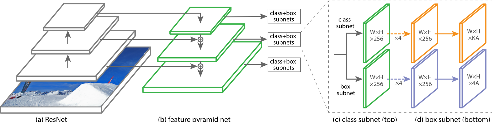
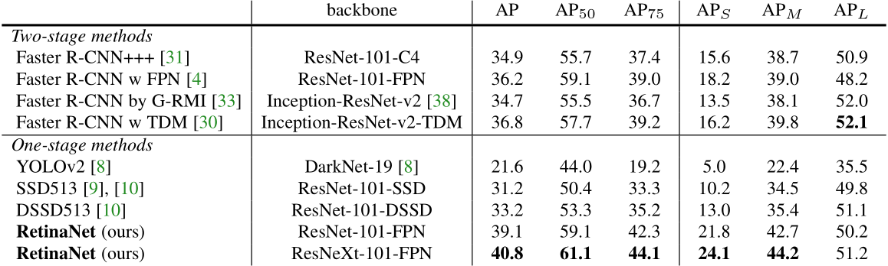

# Focal Loss for Dense Object Detection

## 一，论文翻译

### 摘要

最近准确率较高RCNN二阶段检测器是应用在稀疏待选框上的分类器。相比之下，一阶段的检测器是进行规律而密集的采样，会更快，也更简单，但在准确率上落后二阶段检测器。

经分析，密集检测器训练时的前景/背景数量不均衡可能是核心问题。

所以我们提出了，重设计交叉熵来降低易分类别的loss权值，即Focal Loss，聚焦于在一系列稀疏的困难样本上训练，避免大量易分类样本在训练时的压倒性优势。为了评价loss的有效性，我们设计和训练了一个简单的稠密检测器，命名为RetinaNet。结果表明，RetinaNet在focal loss下的模型可以匹敌一阶段模型的速度，但是准确率却远超所有sota的二阶段检测器。

[github_link](https://github.com/facebookresearch/Detectron)

### 介绍

目前sota的目标检测器是基于二阶段和proposal的机制。比如RCNN系列框架，第一阶段生成稀疏的目标框候选位置，第二阶段用CNN网络区分候选框为前景或背景。由于一系列的[优点](https://github.com/sophia-hxw/cvInterview/blob/main/Detection/one_stage_vs_two_stage.md)，二阶段的架构始终在COCO benchmark上霸榜。

尽管二阶段的检测器很成功，仍会有个疑问：简单的一阶段检测器也可以达到类似精度么？众所周知，一阶段检测器是作用在规律而密集、不同尺度和长宽比的对象采样上。最近的一阶段检测器，诸如YOLO和SSD，让我们看到了希望，更快且准确率对比二阶段检测器大约有10%-40%的差距。

本文基于上述工作，提出了一个一阶段检测器，第一次在COCO　AP上匹敌更复杂且是sota的二阶段检测器，比如FPN和Faster RCNN变形得到的Mask RCNN。为了达到这个效果，我们直面阻碍一阶段检测器达到sota结果的最大绊脚石，即类别不均衡，提出了新的loss函数来解决这个问题。

类别不均衡是在类RCNN的二阶段检测器中做启发式采样时产生的，proposal的阶段(Selective Search, EdgeBoxes, DeepMask, RPN)会迅速减少候选框数量到1~2k，过滤掉大部分的背景采样。在第二个分类阶段，用启发式采样，采样策略可诸如固定前景、背景比例为`1/3`，或者用线上困难样本挖掘(OHEM)等，来平衡前景和背景的数量不均衡问题。

相比之下，一阶段检测器需要处理从图像中规律采样的大量候选位置，实践中数量一般能到~100k量级，密集包含了所有的空间位置、尺度和长宽比。虽然也是启发式采样，但是在简单区分前景和背景的主流程中，这个样本策略是相当低效的。这个低效问题是目标检测中的典型问题，常用boostrapping或者困难样本挖掘来解决。

文本中，我们提出一个新的loss函数来解决类别不均衡问题，能动态调整交叉熵损失，随着目标分类的置信度增长，调整系数会衰减到零。直观上看，调整系数可以在训练过程中自动给易分样本降低loss权重，同时也能促使模型更快作用在困难样本上。实验表明，Focal Loss让我们训练出了一个高准确率的一阶段检测器，表现远优于使用启发式采样或困难样本挖掘等方式训练的模型。最后，需要指出，Focal Loss表达形式不唯一，我们采用其他形式也达到类似效果。

为了证明loss是有效的，我们设计了一个简单的一阶段检测器，即RetinaNet，同样是需要在输入图片上密集采样。该网络有效形成了特征金字塔并使用anchor box。RetinaNet是有效而精准的，最好的基于ResNet-101-FPN backbone的模型，在COCO测试集上获得了39.1AP，速度是5fps，远高于现已经公开的任何一阶段或二阶段模型。

### 相关工作

#### 经典的目标检测器

sliding-window和应用在图像金字塔上的分类器较长一段时间活跃在目标检测的舞台，最早的经典算法就是LeCun的手写体识别。Viola和Jones将级联检测器用于人脸检测，引领了这些模型的广泛应用。HOG和图像三通道特征提取，在行人检测的方向上产生了很多高效模型。DPMs将密集检测器算法拓展到了一般目标分类器，也霸榜PASCAL多年。由此，sliding-window称为经典机器视觉中目标检测的主线，与此同时，深度学习开始复兴了，即将介绍的二阶段检测器很快就攻占了目标检测领域。

#### 二阶段检测器

现代目标检测的主流方法是两阶段方法，受Selective Search启发，第一阶段生成候选框稀疏集，过滤掉大部分背景，第二阶段对候选框进行背景或前景分类。RCNN将第二阶段的分类器整合到CNN网络中，在准确率上获得了较大提升，也引领了现代目标检测领域。RCNN之后经历了多年的提升，包括速度上和对目标框的学习上。RPN(Region Proposal Networks)整合了候选框生成和第二阶段的分类器，集中到到同一个CNN中，催生了Faster RCNN和其他基于此的大量框架。

#### 一阶段检测器

OverFeat是深度网络兴起后，目标检测领域的第一个一阶段模型，更近的是YOLO和SSD系列，刷新了一阶段网络。这些检测器在速度上表现亮眼，却以牺牲部分准确率为代价，比如SSD的AP降低了10%~20%，而YOLO在速度与精度权衡上做出的妥协就更多了。近期，很多二阶段检测器可以改变输入图片分辨率和候选框数量来进行提速，但是一阶段方法却不能在更大图片上获得更高准确率。相较之下，本文的目的在于，理解一阶段检测器，判断是否可在与当前相近或更快的速度下，匹敌或者超过二阶段检测器的准确率。

RetinaNet参考了很多之前密集检测器的设计，比如RPN提出的anchor，SSD和FPN都使用的特征金字塔。再次强调，这个简单检测器的优势不在于网络的创新设计，而是最新设计的loss函数。

#### 类别不均衡

如boosted、DPMs或SSD等检测器，都会面临训练时样本不均衡的问题。这些检测器平均每张图片要预测1w~10w个候选框，但实际上只有极少数框是包含对象的。样本不均衡会造成两个问题：1，多数位置都是简单的负样本，会造成训练无效；2，多数情况下，简单的负样本会在训练中占压倒性比例，影响模型的泛化能力。通常的解决方法是使用困难样本挖掘、其他复杂的采样策略或权重再定义策略。相比之下，本文展示的Focal Loss函数可以自然的解决一阶段模型中的类别不均衡问题，可以日常训练所有的样本而不需要使用采样策略，不会有过多的简单负样本来更新loss或回传梯度。

#### 鲁棒性评价【待确认？】

当然也会有很多人的兴趣点在重新设计更鲁棒的loss函数上，意图减少离群点(较大误差的点，即困难样本)的权重来降低其贡献。相比于找出离群点(困难样本)，Focal Loss是降低类别不均衡中的内点(简单样本)权重，这样尽管简单样本数量大，但会降低对整个loss的贡献。换句话说，Focal Loss从鲁棒loss的相反方向来思考，让训练更集中在困难样本上。

### Focal Loss

Focal Loss是为了解决一阶段检测器中的前景、背景的不均衡(比如1:1000)问题，首先回顾下二分类的交叉熵损失(CE)：
$$
CE(p,y)=\begin{cases}
-log(p) & if \quad y = 1\\
-log(1-p) & otherwise.
\end{cases}
$$
其中 $ y \in \{+1,-1\} $表示 ground truth的类别标签，$ p \in [0,1] $ 是模型在 $ y=1 $ 时的预测结果值，为了方便记录，定义：
$$
p_{t}=\begin{cases}
p & if \quad y=1 \\
1-p & otherwise.
\end{cases}
$$
那么CE损失可以重写为: $$CE(p,y) = CE(p_{t}) = -log(p_{t})$$.

前面的图像中，最上面，$ \gamma=0 $ 即是CE损失的图像，从图像中看出，当 $ p_{t}>>.5 $ 时，loss是个相对较大的非零值。如果有很多个这样的易分类样本，聚小成大，对loss的影响就会导致模型在某些类别上的表现有压倒性优势。

#### Balanced交叉熵

交叉熵中常用一个系数 $ \alpha $ 来调整类别 1，用系数 $ 1-\alpha $ 来调整类别 -1，实际中 $ \alpha $ 可能会频繁被另一个类别颠倒或者在交叉验证时被当作一个超参数。为了记录方便，用类似 $ p_{t} $ 来定义 $ \alpha_{t} $ ，由此重写 $ \alpha $ -balanced交叉熵：
$$
CE(p_{t}) = -\alpha_{t}log(p_{t})
$$
这就是CE函数的简单拓展，作为我们设计focal loss的基础。

#### Focal Loss定义

我们的实验能够得出，会在密集候选框检测器训练时遇到类别不均衡问题，导致密集对象在交叉熵损失中有压倒性优势，易分类样本占了loss的主导并影响梯度的回传。尽管 $ \alpha $ 会平衡前景和背景，但是它无法区分容易还是困难样本。相应的，我们提出对loss函数进行变形来降低易分类样本的loss权重，让训练更聚焦在困难样本上。

在交叉熵的公式上，我们提出了新增一个调节参数 $ (1-p_{t})^{\gamma} $ ，其中 $ \gamma \geq 0 $ 是可调试的聚焦参数，定义focal loss函数：
$$
FL(p_{t}) = -(1-p_{t})^{\gamma}log(p_{t})
$$
focal loss有两个特性：第一，当样本分类错误且 $ p_{t} $ 较小时，调整参数近似等于 1，其loss基本不会有影响。当 $ p_{t}\to 1 $ ，调整参数近似等于0，所以分类较好的样本，其loss的权重会被大大降低；第二，聚焦参数 $ \gamma $ 平滑地适应易分类样本的loss权重下调。当 $ \gamma = 0 $ ，FL等于CE，随着 $ \gamma $ 的增大，调整参数的影响也会类似的增大，实验中发现 $ \gamma $ 最好的参数为 2.

直观地，调整参数减小了易分类样本的权重，当样本的loss较小时增大了其取值范围。比如， $ \gamma = 2 $ 时，若样本的分类置信度 $ p_{t}=0.9 $ ，相较CE loss，此处的loss会降低100倍，而当 $ p_{t} = 0.968 $ 时这个数值会变成1000倍，。这种特性反过来又会增加分错样本的重要性，focal loss在 $ p_{t} \leq .5 $ 和 $ \gamma = 2 $ 时的loss被减小了4倍以上。

时间中，我们使用的是带 $ \alpha $ 平衡的focal loss的变形：
$$
FL(p_{t}) = -\alpha_{t}(1-p_{t})^{\gamma}log(p_{t})
$$
我们的实验可看出，没有 $ \alpha $ 平衡参数时的模型效果也有小小的提升。最终，我们注意到，loss层在框架中的实现紧跟着sigmoid操作，进一步增强了数值稳定性。

我们的实验结果都是基于focal loss的，具体的公式形式不重要，在附录中的其他方式也有用到focal loss，其中的实验证明了其有效性。

#### 3.3 类别不均衡和模型初始化

二分类的模型在初始化时不管样本的 $ y=1 $ 或者 $ y=-1 $ ，都会给相等的概率值。在这样的初始化方式下，当类别不均衡出现时，频繁出现的类别会成为loss的主导，而且容易造成早期训练不稳定的问题。为了应对这个问题，我们让模型在训练初期遇到较少的前景时给出较高优先级，用 $ \pi $ 来表示这个优先级，在遇到较少的前景对象时，会让计算出的 $ p $ 时一个较小值，比如0.01，这是在模型初始化上的变化，而不是loss函数的。在训练时遇到严重的类别不均衡问题时，无论是交叉熵还是focal loss都可以用这个方式来提高稳定性。

#### 3.4 样本不均衡和二阶段检测器

二分类的检测器通常直接用的交叉熵损失，既没有 $ \alpha $ 平衡系数，也没有使用我们提出的focal loss。通过两种机制来解决类别不均衡问题：第一，二阶段的级联；第二，小批量偏置采样(minibatch sampling)。第一个级联是给出候选proposal，将可能的目标位置从几乎无限减少到1k~2k。需要指出的是，候选框并不是随机选择的，是根据真实目标的位置选择的，去掉了大部分的简单负样本。训练第二个阶段时，偏置采样会被典型应用在小批量的样本上，比如1:3的正负样本比例。这个比例值其实有点类似 $ a $ 平衡系数的作用，在具体采样时进行调控。本文提出的focal loss会通过loss设计将这些策略直接用在一阶段的检测器。

### 4 Retina Net检测器

RetinaNet是个完整地一阶段网络，有backbone和两个特定任务的子网络。backbone的作用是通过一个完整图片输入得到特征图。第一个子网络是在backbone输出的基础上进行目标分类，第二个子网络是做bbox回归。在本文的一阶段、密集检测任务中，这两个子网络设计很简单。当然，这些组成部分后面有详细介绍，大部分的设计中参数在实验中都表现得对具体值并不敏感，下面介绍RetinaNet的每一个网络细节。

##### 特征金字塔网络backbone

将FPN用在RetinaNet的backbone上，FPN在普通的CNN基础上，接受一个单尺度的输入图片，有一个自顶向下的特征路径并在同尺度的特征图上进行横向连接，所以网络会有丰富的、多尺度的特征金字塔。每个特征金字塔层都可在不同的尺度上进行目标检测。FPN在FCN的基础上提高了多尺度的检测，还有RPN和DeepMask风格的proposal，跟Fast RCNN和Mask RCNN等二阶段检测器一样表现优异。

本文将FPN的结构用在ResNet上，构建了 $ P_{3} $ 到 $ P_{7} $ 的特征金字塔， $ P_{l} $ 中的 $ l $ 表示金字塔的层级，也表示当前的特征图在分辨率上较输入减少了 $ 2^{l} $ 倍。在FPN网络中，所有金字塔层级的最终输出通道都是256，本文在应用时有些微的差别。其他的设计都是常规的，FPN的backbone选择很重要，因为在预备实验中，我们仅使用了ResNet的最后一层，结果模型的AP很低。

##### anchors

本文使用FPN中RPN类似对于anchor的策略， $ P_{3} $ 到 $ P_{7} $ 对应的anchor面积为 $ 32^{2} $ 和 $ 512^{2} $ ，每个特征层使用的anchor有三个长宽比 $ \{1:2, 1:1, 2:1\} $ 。作为FPN的密集采样，在原有长宽比的基础上，本文新增了 $ \{2^{0}, 2^{1/3}, 2^{2/3}\} $ ，上述修改提高我最终的AP。每个层最多有 $ A=9 $ 个anchor，能覆盖输入图像 $ 32\to813 $ 的像素大小。

每个anchor有一个K one-hot向量，其中K表示目标的种类数，有维度为4的位置向量。本文使用修改过的RPN中的分配策略，稍作修改以使用多分类和阈值。特别的，anchor与gt之间的匹配似乎用IoU和0.5作为阈值来判定，面积交并比小于0.4的就是背景。每个anchor最多匹配一个目标框，相应的类别在K长度的ont-hot向量中为1，其他位置为0.如果一个anchor没有匹配到gt，可能面积的交并比在0.4到0.5之间，在训练时会被忽略。框的回归时计算anchor到与之匹配的gt之间的偏移量，如果没有匹配的gt则省略。

##### 分类子网络

作用是对每个空间位置的A个anchor进行K个种类的目标预测，是关联到FPN每层后面的小FCN网络，所有的FPN层共享这个分类子网络的权重。设计很简单，输入是金字塔层中C个通道的特征层，其后是 $ \{3x3\} $ 的卷积和ReLU激活，气候再是K*A个 $ \{3x3\} $ 的卷积。最后的sigmoid会直接给出每个空间位置的二分类输出，本文中 $ C=256 $ 且 $ A=9 $ .

跟RPN不一样的是，本文的对象分类网络更深，仅使用 $ 3x3 $ 的卷积，不与Box回归共享参数，同时也发现，这些高层的设计比特定的超参数更重要。

##### Box回归子网络

与分类子网络平行的就是另一个小的FCN网络，即box回归网络，存在gt的情况下，预测anchor到gt的偏移量。归回子网络是个单独的CNN网络，除非这个偏移量是线性的。不同于其他的工作，本文的bbox回归是在不知道box类别的情况下，使用的参数越少，但是效果一样。分类子网络和box回归子网络是相同的结构，各自有不同的参数。

#### 4.1 推理和训练

##### 推理

RetinaNet由一个单独的FCN组成了ResNet-FPN的backbone，一个分类子网络和一个box回归子网络。所以，infer包括输入图片简单的前传网络。为了提速，每个FPN层只采用top-scoring的1k个框，其后有一个0.05的阈值。所有顶层的预测被整合到一起了，然后用阈值为0.5的NMS之后做出最终的预测结果。

##### Focal Loss

本文使用的就是前文介绍的用于分类子网络的focal loss.当 $ \gamma \in [0.5, 5] $ 时，focal loss的表现较好，最好的情况是 $ \gamma =2 $ 。训练RetineNet时，focal loss用在每个图平均约采样100k的anchor中，这与使用RPN中使用的启发式采样和困难样本挖掘(OHEM和SSD)不太一样，后者需要选择一个较小的anchor集(如，256)作为批量batch.每张图片的总focal loss是约100k的anchor的损失和，用能匹配到gt的anchor数进行归一化。为什么用可匹配到gt的anchor数量进行归一化，而不是所有的anchor数量呢？因为大部分的anchor都是易分类样本，在focal loss下的损失几乎都可以忽略不计。调整参数 $ \alpha $ ，少样本的权重调整参数，也有一个稳定的范围，但是其取值与 $ \gamma $ 相关。通常的做法是， $ \alpha $ 在 $ \gamma $ 递增时进行适量衰减，本文给出的参数是 $ \gamma = 2 $ ， $ \alpha = 0.25 $ 。

##### 初始化

实验中使用了两个backbone: ResNet-50-FPN和ResNet-101-FPN，ResNet-50和ResNet-101是在ImageNet1k上预训练的模型，新增加的FPN的层用相应的数据来初始化。除了RetinaNet的最后一个子网络，所有新的卷积层都使用偏置 $ b=0 $ ， $ \sigma =0.01 $ 的高斯分布。最后的分类子网络卷积层， $ b=-log((1-\pi)/\pi) $ ，其中 $ \pi $ 指示出前景样本，因为其置信度约等于 $ \pi $ 。尽管结果并不太与 $ \pi $ 的具体值相关联，因此在所有实验中取 $ \pi=0.01 $ 。上文中解释了，本文的初始化阻止了大批量的背景anchor来破坏loss的真实呈现，尤其是在训练的初期。

##### 优化

RetinaNet使用随机梯度下降(SGD)训练的，在8块GPU上同步训练，每块GPU的minibatch是2张图片，所以整体来看的minibatch是16张图片。除非特别说明，所有模型都训练90k个迭代次数，初始学习率为0.01，在60k时学习率为0.001，在80k时的学习率为0.0001，数据增强也就使用了水平增强。权重衰减参数为0.9，衰减0.0001，训练的总loss是focal loss和box回归中使用的标准 $ L_{1} $ loss之和，训练时长大概是10-35个小时。

### 5 实验

评价是在COCO benchmark上，训练使用的是常规方式，训练集是COCO trainval35k，验证集是minival的一部分。我们主要的结果是在test-dev上的，指标是COCO AP。

#### 5.1 训练密集检测器

本文用不同的优化策略实验了很多次来分析focal loss的表现，所有的实验使用的是深度为50或者101的ResNet，也使用了特征金字塔，图片的分辨率尺度为600像素。

##### 网路初始化

第一个尝试是用原始的CE loss来训练RetinaNet，不做任何改变，这很快就失败了，模型不收敛。但是，在我们模型的最后一层做简单初始化，比如检测到一个对象，置 $ \pi=0.01 $ 会使训练有效。训练ResNet-50的RetinaNet在COCO上达到了 $ AP=30.2 $ ，结果对 $ \pi $ 并不敏感，所以在所有的实验中都使用 $ \pi=.01 $ 。

##### 平衡交叉熵

下一个尝试是平衡交叉熵，带平衡参数 $ \alpha $ 。当参数 $ \alpha=.75 $ 时，可以获得0.9AP的提升。

##### Focal Loss

focal loss的实验结果可参见表格，同时focal loss引入了一个新的超参数，集聚焦参数 $ \gamma $ 。当 $ \gamma =0 $ ，focal loss也蜕变成CE loss，当 $ \gamma $ 增长，loss函数的形状发生变化，简单样本的loss被抑制得更小，如图一。Focal Loss可以看出，随着 $ \gamma $ 增长，相对CE loss的优势更大。当 $ \gamma=2 $ 时，FL相对平衡交叉熵会有2.9 AP的提升。

见表格1b，为了实验的公平比较，我们给每个 $ \gamma $ 参数挑选出了最佳的调账参数 $ \alpha $ ，我们发现，一般较小的 $ \alpha $ 匹配较大的 $ gamma $ 。总的来看，改变 $ \gamma $ 的影响更大，但是仍旧可以得到的结论是， $ \alpha $ 的变化区间是 $ [.25, .75] $ 。所以实验中我们使用的是 $ \alpha=.25 $ 且 $ \gamma=2 $ 。

##### Focal Loss 的分析

为了更好的理解focal loss，我们实验分析了一个收敛模型的损失分布。使用ResNet-101-FPN-600，参数 $ \gamma=2 $ ， $ AP=36.0 $ ，我们将此模型用在大量的随机图片上，采样约 $ 10^{7} $ 的负样本和约 $ 10^{5} $ 的正样本。下一步，分开讨论正负样本，计算FL值，对损失做归一化之后求和。对归一化的loss，排序后画了图4所示的累积分布函数(简称CDF)。

正负样本的累计分布函数如图4，观察正样本，对不同的 $ \gamma $ 有类似的图像，将近20%的困难正样本占了一半的正样本loss，当 $ \gamma $ 增大，越多的损失进入了这20%的样本，但是影响就越小。 $ \gamma $ 在负样本上的影响却相差比较大， $ \gamma=0 $ 时，正负样本的CDF都是类似的。然而，随着$\gamma$增大，基本上更多的权重都集中到困难负样本上了。实际上，当$\gamma=2$，大部分的损失来源于少部分的样本。图像可以看出，FL能影响简单样本的影响，让更多的注意力放到困难负样本上。

##### OHEM(Online Hard Example Mining)

31号文件提出，可以用高loss的样本构建minibatch来提高二阶段模型的训练，比如，OHEM就是用loss给样本排序，之后应用NMS，再选择较高loss的样本组成minibatch，其中，NMS的阈值和minibatch的具体参数是可调的超参数。像focal loss一样，OHEM让训练更多集中在分类错误的样本，不同的是，OHEM对简单样本直接丢弃。同时，OHEM在SSD中有一个变体应用，在应用了nms之后，使用1:3的正负样本比来组成minibatch，以保证足够的正样本。

在我们的一阶段网络中也测试了OHEM来应用类别不均衡问题，表格1d中展示了原生OHEM和$OHEM 1:3$中nms和minibatch的参数。实验中使用的模型是ResNet-101，FL的结果是$AP=36$，相应的OHEM的AP=32.8，batch=128， nms=.5。在密集检测器中，OHEM较FL低3.2个AP。我们也使用了OHEM其他的参数和变体，但是并没有获得更好的结果。

##### Hinge Loss

最后，在早期实验中，我们也尝试了用hinge loss来训练，对特定的$p_{t}$的loss为零。然而，这个做法并不稳定，也没有获得有意义的结果。其他loss函数的尝试可参见附录。

#### 5.2 模型框架设计

##### anchor 密度

一阶段网络设计时一个重要的考虑因素就是box覆盖图片的空间位置，二阶段网络由于由RPN(region proposal network)可以在任意的位置、尺度、长宽比对目标进行检测，而一阶段网络就智能固定一个采样网格，一个流行的且能获得高覆盖率的做法就是在同一位置使用不同的尺度、长宽比的anchor。

对FPN中每个金字塔层中的每个空间点的anchor尺度和长宽比数量也进行了实验论证，从一个正方形anchor到每个位置12个anchor包含4个尺度( $ 2^{k/4} $ ,  $ k \leq 3 $ )和三个长宽比(0.1, 1, 2)，结果参见1c表格。仅使用一个正方形anchor时的AP=30.3，让我们很惊喜，然而，使用3个尺度和3个长宽比时的AP还可以增长4个点。所以，本文中其他的实验都使用这个配置。

最后，也注意到，大于6-9个anchor之后的模型没有更多的提高了，因为在二阶段的网络里，如果能分类图片中任意位置的框，则性能达到饱和，换一种说法，密度表示了二阶段网络能达到的最好效果，再增加密度则不再有二阶段相对一阶段的优势。

##### 速度 vs 准确率

大的backbone能获得更好的准确率，同时也会降低速度，输入图片尺寸的大小变化也有类似的规律，表格1e中展示这两个参数的影响。图像2给出了RetinaNet的准确率、速度曲线，并与最近的方法在COCO test-dev上进行了比较。图像显示，本文的RetinaNet和focal loss远超其他方法，当然忽略准确率而一味追求速度的模型不在考虑的范围内。输入为600且backbone为ResNet-101-FPN的RetinaNet足以匹配对应的Faster R-CNN，但是122ms对比172ms(Nvidia M40) 的每帧运行时长就有优势了。若增大图片的尺寸，准确率可以优于所有的二阶段检测器，而且更快。若要更快，就只能用ResNet-50-FPN来替换ResNet-101-FPN了，所以如果要高帧率运行，需要独特的网络设计，可以参考其他的文献。同时我们也注意到，在本文发表后，有更多更快、准确率更高的Faster R-CNN网络已经公开。

#### 5.3 对比sota

我们在COCO test-dev上与当前最优的一阶段和二阶段网络进行对比，对比当前最好的一阶段方法，如DSSD，RetinaNet有5.9个点的优势，同时也更快。对比Faster R-CNN，有2.3个点的优势，但是速度快很多。

### 总结

本文发现，类别不平衡是阻止一阶段网络超越二阶段网络的主要原因，由此我们提出了focal loss，在CE loss的基础上给出了调整参数，使训练的模型更多的被困难样本优化。本文的方法是简单且行之有效的，给出了RetinaNet这个一阶段的网络结构，同时多个实验结果也证明了在速度和精度上都是sota。

---

## 二，readpaper阅读
[focal loss](https://readpaper.com/paper/2884561390)   
可查看图表，参考文献和被引文献

---

## 三，解决了类YOLO等一阶段结构的什么问题？
负样本过多造成loss太大，以致于淹没了正样本的loss，不利于目标收敛；   
太多负样本都不在正负样本交界区域，所以是简单负样本，虽然训练时的单个负样本loss值小，但是数量巨大，所以总体的loss值之和很大；   
单个负样本的loss较小，所以回传的收敛作用有限；

---

## 四，网络结构
   
注意点：   
- 1，训练时FPN每一级地所有sample都被用于计算focal loss，loss值加到一起用来训练；   
- 2，测试时FPN每一级只选取score最大的1000个sample来做nms；   
- 3，整个结构不同层的head部分共享参数，但回归和分类的参数不共享；   
- 4，分类分支的最后一级卷积的bias初始化使用之前提到的 $ -log((1-\pi)/\pi) $ .

---

## 五，sota结果比对

---

# 六，学习心得
- 解决了什么问题
    一阶段中的样本不均衡

- 怎么解决的
    新设计的Focal Loss损失函数

- 如何证明已解决问题
    新设计的简单一阶段网络RetinaNet来验证

