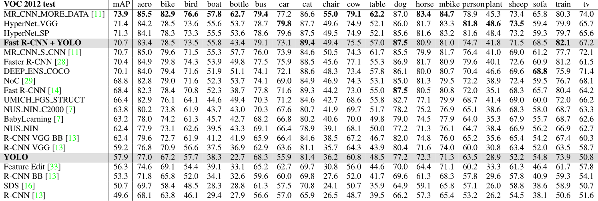

# 摘要
我们提出了 YOLO，一种新的物体检测方法。鉴于之前在目标检测上的工作是基于分类器的，相反，我们将目标检测框架化为“空间分离的边界框”和相关类概率的回归问题。单个神经网络在一次评估中直接从完整图像中预测边界框和类别概率，由于整个检测管道是一个单一的网络，因此可以直接在检测性能上进行端到端的优化。

我们的统一架构非常快，基础 YOLO 模型以每秒 45 帧的速度实时处理图像，较小版本 Fast YOLO 每秒处理 155 帧，同时准确率上是其他实时检测器的两倍 mAP。与最先进的检测系统相比，YOLO 会产生更多的定位错误，但不太可能在背景上预测误报。最后，YOLO 学习了非常通用的目标特征表示。当从自然图像泛化到艺术品等其他领域时，它优于其他检测方法，包括 DPM 和 R-CNN。

# 1，介绍
人类瞥一眼图像并立即知道图像中的对象是什么，它们在哪里，以及它们是如何交互的。 人类的视觉系统快速而准确，让我们能够在几乎没有意识的情况下执行复杂的任务，比如驾驶。 快速、准确的物体检测算法将允许计算机在没有专门传感器的情况下驾驶汽车，使辅助设备能够向人类用户传达实时场景信息，并释放通用、响应机器人系统的潜力。

当前的检测系统重新利用分类器来执行检测，为了检测一个对象，这些系统为该对象使用一个分类器，并在测试图像的不同位置和尺度上对其进行评估。 可变形部件模型 (DPM) 等系统使用滑动窗口方法，其中分类器在整个图像上的均匀间隔位置运行。

最近的方法如 R-CNN 使用区域提议方法首先在图像中生成潜在的边界框，然后在这些提议的框上运行分类器。分类后，后处理用于细化边界框，消除重复检测，并根据场景中的其他对象对框重新评分。这些复杂的管道速度缓慢且难以优化，因为每个单独的组件都必须单独训练。

我们将目标检测重新定义为单个回归问题，直接从图像像素到边界框坐标和类别概率。使用我们的系统，您只需查看图像一次 (YOLO) 即可预测存在哪些对象以及它们在哪里。

YOLO 非常简单：单个卷积网络同时预测多个边界框和这些框的类别概率，YOLO 在完整图像上训练并直接优化检测性能。与传统的对象检测方法相比，这种统一模型有几个优点。

首先，**YOLO 非常快**。由于我们将检测视为回归问题，因此我们不需要复杂的管道。我们只是在测试时在新图像上运行我们的神经网络来预测检测。我们的基础网络以每秒 45 帧的速度运行，在 Titan X GPU 上没有批处理，快速版本的运行速度超过 150 fps。这意味着我们可以以不到 25 毫秒的延迟实时处理流视频。此外，YOLO 的平均精度是其他实时系统平均精度的两倍以上。

其次，**YOLO 在进行预测时会对图像进行全局推理**。与基于滑动窗口和区域提议的技术不同，YOLO 在训练和测试期间看到整个图像，因此它隐式编码了关于类及其外观的上下文信息。 Fast R-CNN 是一种顶级检测方法，由于无法看到更大的上下文，因此将图像中的背景补丁误认为是对象。与 Fast R-CNN 相比，YOLO 的背景错误数量不到一半。

第三，**YOLO 学习目标的一般性特征表达**。当在自然图像上进行训练并在艺术品上进行测试时，YOLO 在很大程度上优于 DPM 和 R-CNN 等顶级检测方法。由于 YOLO 是高度可推广的，因此在应用于新领域或意外输入时不太可能崩溃。

YOLO 在准确性方面仍然落后于最先进的检测系统，虽然它可以快速识别图像中的物体，但它很难精确定位一些物体，尤其是小物体，我们在实验中进一步研究了这些权衡。

我们所有的训练和测试代码都是开源的。还可以下载各种预训练模型。

# 2，统一框架
我们将目标检测的独立组件统一到同一个神经网络中，使用来自整个图像的特征来预测每个边界框，同时能预测图像所有类别的所有边界框。这意味着网络需要对完整图像和图像中的所有对象进行全局推理，YOLO 设计支持端到端训练和实时速度，同时保持高平均精度。

我们的系统将输入图像划分为 S × S 网格。如果对象的中心落入网格单元中，则该网格单元负责检测该对象。

每个网格单元预测 B 个边界框和这些框的置信度分数，这些置信度分数反映了模型对单元格包含对象的信心程度，以及它认为盒子预测的准确度。形式上，我们将置信度定义为 $ Pr(Object) * IoU^{truth}_{pred} $ 。如果该单元格中不存在对象，则置信度应为零，否则，我们希望置信度得分等于预测框和真实标注之间的交集（IOU）。

每个边界框由 5 个预测组成：x、y、w、h 和置信度，(x, y) 坐标表示相对于网格单元边界的框中心，宽度和高度是相对于整个图像预测的。最后，置信度预测表示预测框和任何真实框之间的 IOU。

每个网格单元还预测 C 个条件类概率，Pr(Class i | Object)。这些概率以包含对象的网格单元为条件。我们只预测每个网格单元的一组类概率，而不管框 B 的数量。

在测试时，我们将条件类概率和单个框置信度预测相乘，

$$  Pr(Class_{i}|Object)*(Object)*IoU^{truth}_{pred} = Pr(Class_{i})*IoU^{truth}_{pred} $$

这为我们提供了每个框的特定类别的置信度分数，这些分数编码了该类别出现在框中的概率以及预测的框与对象的匹配程度。

为了在 PASCAL VOC 上评估 YOLO，我们使用 S = 7，B = 2。PASCAL VOC 有 20 个标记类别，因此 C = 20。我们的最终预测是一个 7 × 7 × 30 张量。

# 2.1 网络设计
我们将此模型实现为卷积神经网络，并在 PASCAL VOC 检测数据集上对其进行评估，网络的初始卷积层从图像中提取特征，而全连接层预测输出概率和坐标。

我们的网络架构受到用于图像分类的 GoogLeNet 模型的启发，有 24 个卷积层，后跟 2 个全连接层。 我们不使用 GoogLeNet 使用的初始模块，而是简单地使用 1 × 1 缩减层和 3 × 3 卷积层。

我们还训练了一个快速版本的 YOLO，旨在突破快速目标检测的界限。 Fast YOLO 使用具有较少卷积层（9 个而不是 24 个）和这些层中的过滤器较少的神经网络。 除了网络的大小之外，YOLO 和 Fast YOLO 的所有训练和测试参数都是相同的。

我们网络的最终输出是 7 × 7 × 30 的预测张量。

# 2.2 训练
我们在 ImageNet 1000 级竞赛数据集上预训练我们的卷积层，对于预训练，我们使用前 20 个卷积层，然后是平均池化层和全连接层。我们对该网络进行了大约一周的训练，并在 ImageNet 2012 验证集上实现了 88% 的单次裁剪 top-5 准确率，与 Caffe 的 Model Zoo 中的 GoogLeNet 模型相当。

然后我们转换模型以执行检测。任等人表明将卷积层和连接层添加到预训练网络可以提高性能，按照他们的例子，我们添加了四个卷积层和两个具有随机初始化权重的全连接层。检测通常需要细粒度的视觉信息，因此我们将网络的输入分辨率从 224 × 224 增加到 448 × 448。

我们的最后一层预测类别概率和边界框坐标。我们通过图像的宽度和高度对边界框的宽度和高度进行归一化，使它们落在 0 和 1 之间。我们将边界框的 x 和 y 坐标参数化为特定网格单元位置的偏移量，因此它们也被限制在 0 和 1 之间。

我们对最后一层使用线性激活函数，所有其他层都使用以下泄漏整流线性激活：
$$  \varphi (x) = \begin{cases} x & if\, x>0 \\ 0.1x & otherwise \end{cases} $$

我们针对模型输出中的平方和误差进行了优化，使用平方和误差是因为它很容易优化，但是它并不完全符合我们最大化平均精度的目标，它将定位误差与分类误差的权重相等，这可能并不理想。此外，在每个图像中，许多网格单元不包含任何对象。这会将这些单元格的“置信度”分数推向零，通常会压倒包含对象的单元格的梯度。这可能会导致模型不稳定，从而导致训练早期出现分歧。

为了解决这个问题，我们增加了边界框坐标预测的损失，并减少了不包含对象的框的置信度预测的损失。我们使用两个参数 $\lambda_{coord} =5 $ 和 $\lambda_{boobj} =0.5 $ 来实现这一点。

平方和误差也同样可以加权大框和小框的错误，误差度量应该反映大框中的小偏差比小框中的小。为了部分解决这个问题，我们预测边界框宽度和高度的平方根，而不是直接预测宽度和高度。

YOLO 预测每个网格单元有多个边界框，在训练时，我们只希望一个边界框预测器负责每个对象。我们分配一个预测器来“负责”预测一个对象，根据哪个预测具有最高的当前 IOU 和真实框，这导致边界框预测器的专业化。每个预测器在预测特定大小、纵横比或对象类别方面会变得更好，从而提高整体召回率。

## 2.3 推理

## 2.4 YOLO局限

# 3，与其他检测器对比
目标检测是计算机视觉中的核心问题。检测管道通常首先从输入图像中提取一组鲁棒特征（Haar、SIFT、HOG、卷积特征）。然后，使用分类器或定位器来识别特征空间中的对象。这些分类器或定位器以滑动窗口的方式在整个图像或图像中的某些区域子集上运行。我们将 YOLO 检测系统与几个顶级检测框架进行了比较，突出了关键的异同。

**DPM**。可变形零件模型 (DPM) 使用滑动窗口方法进行对象检测。 DPM 使用不相交的管道来提取静态特征、对区域进行分类、预测高分区域的边界框等。我们的系统用单个卷积神经网络替换了所有这些不同的部分。该网络同时执行特征提取、边界框预测、非极大值抑制和上下文推理。网络不是静态特征，而是在线训练特征并针对检测任务优化它们。我们的统一架构带来的是比 DPM 更快、更准确的模型。

**R-CNN**。 R-CNN 及其变体使用区域提议而不是滑动窗口来查找图像中的对象。选择性搜索生成潜在的边界框，卷积网络提取特征，SVM 对框进行评分，线性模型调整边界框，非最大抑制消除重复检测。这个复杂管道的每个阶段都必须独立精确地调整，结果系统非常慢，在测试时每张图像需要超过 40 秒。

**YOLO**。YOLO 与 R-CNN 有一些相似之处。每个网格单元提出潜在的边界框并使用卷积特征对这些框进行评分。然而，我们的系统对网格单元提议施加了空间限制，这有助于减轻对同一对象的多次检测。我们的系统还提出了更少的边界框，每张图像只有 98 个，而来自 Selective Search 的大约 2000 个。最后，我们的系统将这些单独的组件组合成一个单一的、联合优化的模型。

**其他快速检测器**。 Fast 和 Faster R-CNN 专注于通过共享计算和使用神经网络来提议区域而不是选择性搜索来加速 R-CNN 框架。尽管它们比 R-CNN 提供了速度和准确性的改进，但两者都仍达不到实时性能。

许多研究工作集中在加速 DPM 管道。它们加速 HOG 计算，使用级联并将计算推送到 GPU。然而，实际上只有 30Hz DPM 实时运行。

YOLO 没有尝试优化大型检测管道的各个组件，而是完全抛弃了管道，并且设计速度很快。

像人脸或人这样的单一类别的检测器可以高度优化，因为它们需要处理的变化要少得多。 YOLO 是一种通用检测器，可以学习同时检测各种物体。

**Deep MultiBox**。与 R-CNN 不同，Szegedy 等人训练卷积神经网络来预测感兴趣的区域，而不是使用选择性搜索。 MultiBox 还可以通过用单个类预测替换置信度预测来执行单个对象检测。然而，MultiBox 不能执行一般的对象检测，仍然只是更大检测管道中的一个部分，需要进一步的图像块分类。 YOLO 和 MultiBox 都使用卷积网络来预测图像中的边界框，但 YOLO 是一个完整的检测系统。

**OverFeat**。 Sermanet 等人训练一个卷积神经网络来执行定位并调整该定位器来执行检测。 OverFeat 有效地执行滑动窗口检测，但它仍然是一个不相交的系统。 OverFeat 优化定位，而不是检测性能。与 DPM 一样，定位器在进行预测时只看到本地信息。 OverFeat 无法推理全局上下文，因此需要大量的后处理来产生相干检测。

**MultiGrasp**。 我们的工作在设计上类似于 Redmon 等人的抓握检测工作。 我们用于边界框预测的网格方法基于 MultiGrasp 系统，用于回归到抓取。 然而，抓取检测比物体检测简单得多。 MultiGrasp 只需要为包含一个对象的图像预测单个可抓取区域。 它不必估计物体的大小、位置或边界或预测它的类别，只需找到适合抓取的区域即可。 YOLO 预测图像中多个类别的多个对象的边界框和类别概率。

# 4，实验
首先，我们将 YOLO 与 PASCAL VOC 2007 上的其他实时检测系统进行比较。为了了解 YOLO 和 R-CNN 变体之间的差异，我们探索了 YOLO 和 Fast R-CNN（性能最高的版本之一）在 VOC 2007 上的错误 R-CNN。 基于不同的错误特征，我们表明 YOLO 可用于重新评分 Fast R-CNN 检测并减少来自背景误报的错误，从而显着提高性能。 我们还展示了 VOC 2012 结果并将 mAP 与当前最先进的方法进行了比较。 最后，我们表明 YOLO 在两个sota数据集上比其他检测器更好地泛化到新领域。

## 4.1 与其他实时检测器比较

## 4.2 VOC 2007误检分析

## 4.3 整合Fast RCNN和YOLO

## 4.4 VOC 2012结果

## 4.5 一般特性在行人检测上的应用

# 5，真实场景的实时检测
YOLO 是一种快速、准确的物体检测器，非常适合计算机视觉应用。 我们将 YOLO 连接到网络摄像头并验证它是否保持实时性能，包括从摄像头获取图像和显示检测的时间。 由此产生的系统是互动的和引人入胜的。 虽然 YOLO 单独处理图像，但当连接到网络摄像头时，它的功能就像一个跟踪系统，在物体四处移动和外观变化时检测它们。 

# 6，结论
我们介绍了 YOLO，一种用于物体检测的统一模型。 我们的模型构建简单，可以直接在完整图像上进行训练。 与基于分类器的方法不同，YOLO 是在与检测性能直接对应的损失函数上训练的，并且整个模型是联合训练的。

Fast YOLO 是文献中最快的通用目标检测器，YOLO 推动了实时目标检测的最新技术。 YOLO 还可以很好地推广到新的领域，使其成为依赖快速、稳健的对象检测的应用程序的理想选择。

