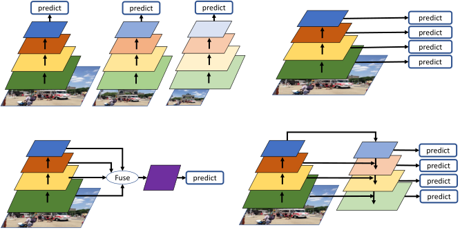
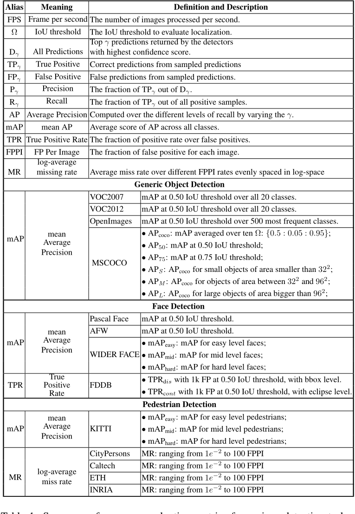

# 摘要
目标检测是计算机视觉中的一个基本视觉识别问题，在过去的几十年中得到了广泛的研究。视觉对象检测旨在在给定图像中找到具有精确定位的特定目标类的对象，并为每个对象实例分配一个相应的类标签。由于基于深度学习的图像分类的巨大成功，近年来使用深度学习的对象检测技术得到了积极的研究。在本文中，我们对深度学习视觉对象检测的最新进展进行了全面调查。通过回顾大量近期相关文献，我们系统地分析了现有的对象检测框架，并将调查分为三个主要部分：
- (i) 检测组件；
- (ii) 学习策略；
- (iii) 应用程序和基准测试。

在调查中，我们详细介绍了影响检测性能的各种因素，例如检测器架构、特征学习、建议框生成、采样策略等。最后，我们讨论了几个未来的方向，以促进和推动视觉对象检测的未来研究与深度学习。

关键词：对象检测，深度学习，深度卷积神经网络

# 1，介绍
在计算机视觉领域，有几个基本的视觉识别问题：图像分类、对象检测和实例分割和语义分割。特别是，图像分类旨在识别给定图像中对象的语义类别。对象检测不仅可以识别对象类别，还可以通过边界框预测每个对象的位置。语义分割旨在预测逐像素分类器，为每个像素分配一个特定的类别标签，从而提供对图像更丰富的理解。然而，与对象检测相反，语义分割不区分同一类别的多个对象。在对象检测和语义分割的交叉点上，提出了一种相对较新的设置，称为“实例分割”，用于识别不同的对象并为每个对象分配一个单独的分类像素级掩码。事实上，实例分割可以被视为对象检测的一种特殊设置，其中不需要通过边界框定位对象，而是需要像素级定位。在本次调查中，我们将注意力集中在回顾基于深度学习的对象检测方面的主要工作。一个好的检测算法应该对语义线索以及图像的空间信息有很强的理解。事实上，物体检测是许多计算机视觉应用的基本步骤，例如人脸识别，行人检测，视频分析和标志检测。

在早期，在深度学习时代之前，目标检测的流程分为三个步骤：i) 提议生成； ii) 特征向量提取；和 iii) 区域分类。在提议生成期间，目标是搜索图像中可能包含对象的位置。这些位置也称为感兴趣区域 (roi)。一个直观的想法是使用滑动窗口扫描整个图像。为了捕获有关对象的多尺度和不同纵横比的信息，将输入图像调整为不同的尺度，并使用多尺度窗口在这些图像中滑动。第二步，在图像的每个位置，从滑动窗口获得一个固定长度的特征向量，以捕获覆盖区域的判别语义信息。该特征向量通常由低级视觉描述符编码，例如 SIFT（尺度不变特征变换）、Haar、HOG（梯度直方图）或 SURF（加速鲁棒特征），这对尺度、光照和旋转方差表现出一定的鲁棒性。最后，在第三步中，学习区域分类器为覆盖区域分配分类标签。通常，这里使用支持向量机（SVM），因为它们在小规模训练数据上表现良好。此外，在区域分类步骤中使用了一些分类技术，如bagging、级联学习和 adaboost，从而进一步提高了检测精度。

大多数成功的传统目标检测方法都专注于精心设计特征描述符以获得感兴趣区域的嵌入。借助良好的特征表示和稳健的区域分类器，在 Pascal VOC 数据集（用于基准对象检测的公开可用数据集）上取得了令人印象深刻的结果。值得注意的是，基于可变形部件的机器 (DPM) 是一种突破性的检测算法，在 2007、2008 和 2009 年的 VOC 挑战赛中三度获胜。DPM 学习并集成具有可变形损失的多个部件模型，并使用用于判别训练的潜在 SVM。然而，在 2008 年到 2012 年期间，基于这些传统方法的 Pascal VOC 的进展变得渐进式，从构建复杂的集成系统中获得了微小的收益。这显示了这些传统探测器的局限性。最突出的是，这些限制包括：（i）在提案生成期间，生成了大量提案，其中许多是多余的；这导致分类期间出现大量误报。而且，窗口比例尺是手动设计的，启发式设计的，不能很好地匹配对象； (ii) 特征描述符是基于低级视觉线索手工制作的，这使得很难在复杂的上下文中捕获代表性语义信息。 (iii) 检测流程的每一步都是单独设计和优化的，因此无法获得整个系统的全局最优解。

在成功应用深度卷积神经网络（DCNN）进行图像分类之后，基于深度学习技术的目标检测也取得了显着进展。新的基于深度学习的算法以巨大的优势超越了传统的检测算法。深度卷积神经网络是一种用于计算层次特征的受生物学启发的结构。 Fukushima 提出的“neocognitron”是为图像分类构建这种分层和空间不变模型的早期尝试。然而，这种早期的尝试缺乏有效的监督学习优化技术。基于这个模型，Lecun 等人通过反向传播通过随机梯度下降 (SGD) 优化卷积神经网络，并在数字识别方面表现出有竞争力的性能。然而，在那之后，深度卷积神经网络并没有被深入探索，支持向量机变得更加突出。这是因为深度学习有一些局限性：(i) 缺乏大规模带标注的训练数据，导致过拟合； (ii) 有限的计算资源； (iii) 与 SVM 相比，理论支持较弱。 2009 年，贾等人收集了一个包含 1.2M 高分辨率图像的大规模注释图像数据集 ImageNet，使得用大规模训练数据训练深度模型成为可能。随着并行计算系统（如 GPU 集群）上计算资源的发展，2012 年 Krizhevsky 等人使用 ImageNet 数据集训练了一个大型深度卷积模型，与所有其他方法相比，在大规模视觉识别挑战（ILSVRC）上显示出显着改进。在成功应用 DCNN 进行分类后，深度学习技术迅速适应了其他视觉任务，并且与传统方法相比显示出有希望的结果。

与传统检测器中使用的手工描述符相比，深度卷积神经网络生成从原始像素到高级语义信息的分层特征表示，这些特征表示是从训练数据中自动学习的，并在复杂的上下文中显示出更具辨别力的表达能力。 此外，得益于强大的学习能力，深度卷积神经网络可以在更大的数据集下获得更好的特征表示，而传统的视觉描述符的学习能力是固定的，无法在更多数据可用时提高。 这些特性使得设计基于深度卷积神经网络的目标检测算法成为可能，该算法可以端到端的方式进行优化，具有更强大的特征表示能力。

目前，基于深度学习的对象检测框架主要可以分为两大类：(i) 两阶段检测器，例如基于区域的 CNN (R-CNN)及其变体，(ii) 一级检测器，例如 YOLO及其变体。两阶段检测器首先使用提议生成器生成一组稀疏提议并从每个提议中提取特征，然后是区域分类器预测提议区域的类别。一级检测器直接对特征图的每个位置上的对象进行分类预测，而无需级联区域分类步骤。两级检测器通常可以实现更好的检测性能并在公共基准上报告最先进的结果，而一级检测器的时间效率明显更高，并且对实时对象检测具有更大的适用性。

本文是全面了解基于深度学习的对象检测算法。我们回顾了基于深度学习的对象检测的各种贡献，并将它们分为三组：检测组件、学习策略以及应用程序和基准。对于检测组件，我们首先介绍两个检测设置：边界框级别（bbox-level）和像素掩码级别（mask-level）定位。 Bbox 级算法需要通过矩形边界框来定位对象，而在掩码级算法中需要更精确的像素级掩码来分割对象。接下来，我们总结了两个检测家族的代表性框架：两阶段检测和一阶段检测。然后我们对每个检测组件进行了详细调查，包括主干架构、提议生成和特征学习。对于学习策略，由于训练检测器的难度，我们首先强调了检测学习策略的重要性，然后详细介绍了训练和测试阶段的优化技术。最后，我们回顾了一些基于现实世界物体检测的应用，包括人脸检测、行人检测、标志检测和视频分析。我们还讨论了这些检测任务的公开可用和常用的基准和评估指标。最后，我们展示了近年来在公共基准上进行通用检测的最新成果。

我们希望本文能够为研究人员和从业人员提供及时的回顾，以进一步促进对检测系统的研究。 论文的其余部分组织如下：
- 在第 2 节中，我们给出了目标检测的标准问题设置；
- 第 3 节列出了检测器组件的详细信息；
- 第 4 节介绍了学习策略；
- 第 5 节和第 6 节提供了用于实际应用和基准的检测算法；
- 第 7 节列出了通用检测；
- 最后，我们在第 8 节总结和讨论未来的方向。

# 2，标准问题设置
在本节中，我们提出了基于深度学习的对象检测的正式问题设置。 对象检测涉及识别（例如，“对象分类”）和定位（例如，“位置回归”）任务。 对象检测器需要通过精确定位和对每个对象实例的正确分类标签预测，将某些目标类别的对象与图像中的背景区分开来，预测边界框或像素掩码以定位这些目标对象实例。

更一般的，若有N个带标注的图片${x_{1}, x_{2}...x_{N}}$，对第$i^{th}$张图片$x_{i}$，有$M_{i}$个物体属于C个类别，记作：
$$y_{i} = {(c^{i}_{1}, b^{i}_{1}),(c^{i}_{2}, b^{i}_{2})...(c^{i}_{i}, b^{i}_{i})}$$
其中$c^{i}_{j} \in C$代表类别，$b^{i}_{j}$代表$x_{i}$图片中第$j$个对象的空间坐标。检测器$f$可由$\theta$参数化，即对于$x_{i}$，推理结果与$y_{i}$的形式相同：
$$y^{i}_{pred} = {(c^{i}_{pred_{1}}, b^{i}_{pred_{1}}),(c^{i}_{pred_{2}}, b^{i}_{pred_{2}})...}$$
所以损失函数就是优化下列检测器：
$$l(x,\theta) = \frac{1}{N}\sum^{N}_{i=1}l(y^{i}_{pred}, x_{i}, y_{i};\theta)+\frac{\lambda}{2}||\theta ||^{2}_{2}$$
其中，第二项是带参数的归一化项，不同的loss函数有不同的侧重点，这块将在第4部分讲解。

在进行指标评价时，有一个变量经常用到，就是bbox和gt之间的IoU值，其定义如下：
$$IoU(b_{pred}, g_{gt}) =  \frac{Area(b_{pred}\cap b_{gt})}{Area(b_{pred}\cup b_{gt})}$$
推理中应用的IoU方式一般为：
$$Prediction = \begin{cases} Positive & c_{pred} = c_{gt} \, and\, IoU(b_{pred},b_{gt})>\omega \\ Negative & othersize \end{cases}$$

对于通用对象检测问题评估，使用 C 类上的平均精度 (mAP) 进行评估，并且在行人检测等实际场景中，使用不同的评估指标，这将在第 5 节中讨论。除了检测准确性，推理速度也是评估对象检测算法的重要指标。具体来说，如果我们希望检测视频流中的物体（实时检测），就必须有一个能够快速处理这些信息的检测器。 因此，检测器的效率也是根据每秒帧数 (FPS) 来评估的，即每秒可以处理多少图像。 通常可以达到 20 FPS 推理速度的检测器被认为是实时检测器。

# 3，检测组件
在本节中，我们将介绍对象检测的不同组件。 首先是关于对象检测范式的选择。 我们首先介绍两种检测设置的概念：bbox 级和掩码级算法。 然后，我们介绍两种主要的物体检测范式：两级检测器和一级检测器。 在这些范式下，检测器可以使用各种深度学习主干架构、提议生成器和特征表示模块。

## 3.1 检测设置
对象检测有两种设置：
- i）普通对象检测（bbox 级定位）
- ii）实例分割（像素级或掩码级定位）。 

Vanilla 对象检测已得到更广泛的研究，被认为是传统的检测设置，其目标是通过矩形边界框定位对象。在vanilla 目标检测算法中，只需要bbox标注框，并且在评估中，计算预测的bbox与gt之间的IoU来衡量性能。实例分割是一个相对较新的设置，基于传统的检测设置。实例分割需要通过像素级掩码而不是粗略的矩形边界框来分割每个对象。由于更精确的像素级预测，实例分割对空间错位更敏感，因此对处理空间信息的要求更高。实例分割的评估指标几乎与 bbox 级检测相同，除了 IoU 计算是在掩码预测上执行的。虽然这两个检测设置略有不同，但后面介绍的主要组件大多可以由这两个设置共享。

## 3.2 检测算法路线
当前最先进的深度学习目标检测器主要可以分为两大类：两级检测器和一级检测器。对于两阶段检测器，在第一阶段，生成一个稀疏的提议集；在第二阶段，生成的提议的特征向量由深度卷积神经网络编码，然后进行对象类别预测。一级检测器没有单独的提议生成阶段（或学习提议生成）。他们通常将图像上的所有位置都视为潜在对象，并尝试将每个感兴趣的区域分类为背景或目标对象。两阶段检测器经常在许多公共基准数据集上报告最先进的结果。然而，它们通常在较低的推理速度方面存在不足。一级检测器在实时物体检测应用中速度更快，更受欢迎，但与二级检测器相比，其性能相对较差。

### 3.2.1 二阶段检测算法
两阶段检测器将检测任务分为两个阶段：（i）提议生成； (ii) 对这些提议进行预测。 在提议生成阶段，检测器将尝试识别图像中可能是对象的区域。 这个想法是提出具有高召回率的区域，使得图像中的所有对象至少属于这些提议区域中的一个。 在第二阶段，基于深度学习的模型用于使用正确的分类标签对这些建议进行分类。 该区域可以是背景，也可以是来自预定义类标签之一的对象。 此外，该模型可以改进提案生成器建议的原始定位。 接下来，我们回顾了两阶段检测器中一些最有影响力的工作。

**R-CNN** 是 Girshick 等人提出的开创性的两阶段目标检测器。在 2014 年。 与之前基于传统检测框架 SegDPM 的最先进方法相比，Pascal VOC2010 上的 mAP 为 40.4%，R-CNN 显着提高了检测性能并获得了 53.7% 的 mAP。R-CNN 的管道可以分为三个部分：i) 提议生成，ii) 特征提取和 iii) 区域分类。对于每张图像，R-CNN 通过选择性搜索生成一组稀疏的提议（大约 2,000 个提议），旨在拒绝可以轻松识别为背景区域的区域。然后，每个提议被裁剪并调整为固定大小的区域，并由深度卷积神经网络编码为（例如 4,096 维）特征向量，然后是一对多 SVM 分类器。最后，使用提取的特征作为输入来学习边界框回归器，以使原始提议紧密地绑定对象。与传统的手工特征描述符相比，深度神经网络生成分层特征并捕获不同层的不同尺度信息，最终产生用于分类的鲁棒性和判别性特征。利用迁移学习的力量，R-CNN 采用在 ImageNet 上预训练的卷积网络的权重。为检测任务重新初始化最后一个全连接层（FC 层）。然后在预训练模型上对整个检测器进行微调。这种来自 Imagenet 数据集的知识转移提供了显着的性能提升。此外，R-CNN 在训练前拒绝了大量的简单否定，这有助于提高学习速度并减少误报。

然而，R-CNN 面临一些严重的缺点：i）每个提议的特征都是由深度卷积网络单独提取的（即计算不共享），这导致了大量重复的计算。 因此，R-CNN 的训练和测试非常耗时； ii）R-CNN的三个步骤（提议生成、特征提取和区域分类）是独立的组成部分，整个检测框架不能以端到端的方式进行优化，难以获得全局最优解 ; iii) 选择性搜索依赖于低级别的视觉线索，因此难以在复杂的上下文中生成高质量的建议。 此外，它无法享受到的好处
GPU加速。

受到空间金字塔匹配（SPM）思想的启发，何凯明等人提出了 SPP-net 来加速 R-CNN 并学习更多的判别特征。 SPP-net 不是单独裁剪提议区域并输入 CNN 模型，而是使用深度卷积网络从整个图像计算特征图，并通过空间金字塔池化 (SPP) 层在特征图上提取固定长度的特征向量. SPP将特征图划分成一个N×N的网格，对于N的多个值（从而允许在不同尺度上获取信息），并对网格的每个单元进行池化，给出一个特征向量。从每个 N × N 网格获得的特征向量被连接起来以给出该区域的表示。提取的特征被送入区域 SVM 分类器和边界框回归器。与 RCNN 相比，SPP 层还可以在不同尺度和纵横比的图像/区域上工作，而无需调整它们的大小。因此，它不会受到信息丢失和不需要的几何失真的影响。

与 R-CNN 相比，SPP-net 取得了更好的结果，并且具有明显更快的推理速度。然而，SPP-net 的训练仍然是多阶段的，因此无法进行端到端的优化（并且需要额外的缓存来存储提取的特征）。此外，SPP 层没有将梯度反向传播到卷积核，因此 SPP 层之前的所有参数都被冻结。这极大地限制了深度骨干架构的学习能力。吉尔希克等人提出了 Fast R-CNN，这是一种多任务学习检测器，解决了 SPP-net 的这两个局限性。 Fast R-CNN（如 SPP-Net）也为整个图像计算了一个特征图，并在特征图上提取了固定长度的区域特征。与 SPP-net 不同，Fast R-CNN 使用 ROI Pooling 层来提取区域特征。 ROI 池化层是 SPP 的一个特例，它只需要一个尺度（即 N × N 网格只有一个 N 值）将提议划分为固定数量的分区，并将误差信号反向传播到卷积核。在特征提取之后，特征向量被输入到两个兄弟输出层之前的一系列全连接层：分类层（cls）和回归层（reg）。分类层负责生成 C+1 类（C 类加一个背景类）的 softmax 概率，而回归层编码 4 个实值参数以细化边界框。在 Fast RCNN 中，特征提取、区域分类和边界框回归步骤都可以端到端优化，无需额外的缓存空间来存储特征（与 SPP Net 不同）。 Fast R-CNN 实现了比 R-CNN 和 SPP-net 更好的检测精度，并且具有更好的训练和推理速度。

尽管在学习检测器方面取得了进展，但提案生成步骤仍然依赖于传统方法，如选择性搜索或边缘框，这些方法基于低级视觉线索，无法在数据驱动的方式。为了解决这个问题，开发了 Faster R-CNN，它依赖于一种新颖的提议生成器：区域提议网络（RPN）。这个提议生成器可以通过监督学习方法来学习。 RPN 是一个完全卷积的网络，它采用任意大小的图像并在特征图的每个位置生成一组对象提议。网络使用 n × n 滑动窗口在特征图上滑动，并为每个位置生成一个特征向量。然后将特征向量送入两个兄弟输出分支，对象分类层（对提议是否为对象进行分类）和边界框回归层。然后将这些结果输入到最后一层，用于实际的对象分类和边界框定位。 RPN 可以插入到 Fast R-CNN 中，因此整个框架可以在训练数据上以端到端的方式进行优化。通过这种方式，RPN 能够以数据驱动的方式生成提议，并且还能够享受深层主干网络的判别能力。 Faster R-CNN 能够在 GPU 上以 5FPS 进行预测，并在许多公共基准数据集上取得了最先进的结果，例如 Pascal VOC 2007、2012 和 MSCOCO。目前，有大量基于 Faster R-CNN 的检测器变体，用于不同的用途。

Faster R-CNN 计算输入图像的特征图并提取特征图上的区域特征，跨不同区域共享特征提取计算。然而，计算并未在区域分类步骤中共享，其中每个特征向量仍然需要分别通过一系列 FC 层。这种额外的计算可能非常大，因为每个图像可能有数百个提议。简单地去除全连接层会导致检测性能的急剧下降，因为深度网络会减少建议的空间信息。戴等人提出了基于区域的全卷积网络（R-FCN），它在区域分类步骤中分担了计算成本。 R-FCN生成一个Position Sensitive Score Map，对不同类别的相对位置信息进行编码，并使用Position Sensitive ROI Pooling layer（PSROI Pooling）通过对目标区域的每个相对位置进行编码来提取空间感知区域特征。提取的特征向量保留了空间信息，因此与没有区域全连接层操作的 Faster R-CNN 相比，检测器取得了有竞争力的结果。

Faster R-CNN 的另一个问题是它使用单个深层特征图来进行最终预测。这使得检测不同尺度的物体变得困难。特别是，很难检测到小物体。在 DCNN 特征表示中，深层特征语义强但空间弱，而浅层特征语义弱但空间强。林等人利用这一特性并提出了特征金字塔网络（FPN），该网络将深层特征与浅层特征相结合，以在不同尺度的特征图中实现对象检测。主要思想是通过来自更深层的丰富语义信息来加强空间强的浅层特征。 FPN 在检测多尺度对象方面取得了重大进展，并已广泛应用于许多其他领域，如视频检测和人体姿势识别。

大多数实例分割算法都是从普通对象检测算法扩展而来的。早期的方法通常生成分段建议，然后是用于分段分类的 Fast RCNN。后来，戴等人提出了一种名为“MNC”的多阶段算法，它将整个检测框架分为多个阶段，并从学习到的边界框建议中预测分割掩码，然后由区域分类器进行分类。这些早期的作品在多个阶段进行了 bbox 和 mask 预测。为了使整个过程更加灵活，He等人提出了 Mask R-CNN，它根据建议并行预测边界框和分割掩码，并报告了最先进的结果。 Huang等人基于Mask R-CNN提出了一个掩码质量感知框架，称为掩码评分 R-CNN，它学习了预测掩码的质量并校准了掩码质量和掩码置信度分数之间的错位。

### 3.2.2 一阶段算法
与两阶段检测算法不同，两阶段检测算法将检测管道分为两部分：提议生成和区域分类；一级检测器没有单独的提案生成阶段（或学习提案生成）。他们通常将图像上的所有位置都视为潜在对象，并尝试将每个感兴趣的区域分类为背景或目标对象。

早期成功的基于深度学习的单级检测器之一是由 Sermanet 等人开发的，命名为 Over-Feat。 OverFeat 通过将 DCNN 分类器转换为完全卷积的对象检测器来执行对象检测。对象检测可以被视为“多区域分类”问题，因此 OverFeat 通过将最后的 FC 层视为 1x1 卷积层以允许任意输入将原始分类器扩展为检测器。分类网络输出对输入的每个区域的预测网格，以指示对象的存在。在识别对象后，学习边界框回归器以基于分类器的相同 DCNN 特征来细化预测区域。为了检测多尺度对象，将输入图像调整为多个尺度，然后输入网络。最后，将所有尺度的预测合并在一起。通过使用卷积层共享重叠区域的计算，与 RCNN 相比，OverFeat 显示出显着的速度强度，并且只需要通过网络向前传递一次。然而，分类器和回归器的训练是分开的，没有联合优化。

后来，雷德蒙等人开发了一种名为 YOLO（你只看一次）的实时检测器。 YOLO 将对象检测视为回归问题，并将整个图像在空间上划分为固定数量的网格单元（例如使用 7 × 7 网格）。每个单元格都被认为是检测压力的提议
一个或多个对象。在最初的实现中，每个单元格都被认为包含（最多）两个对象的中心。对于每个单元格，进行了包含以下信息的预测：该位置是否有对象、边界框坐标和大小（宽度和高度）以及对象的类别。整个框架是一个单一的网络，它省略了可以以端到端方式优化的提案生成步骤。基于精心设计的轻量级架构，YOLO 可以在 45 FPS 时进行预测，并通过更简化的主干达到 155 FPS。然而，YOLO 面临一些挑战：i）它在给定位置最多只能检测两个物体，这使得检测小物体和拥挤的物体变得困难。 ii) 仅使用最后一个特征图进行预测，不适合在多尺度和长宽比下预测对象。

2016 年，刘等人提出了另一种单级检测器 Single-Shot Mulibox Detector (SSD)，它解决了 YOLO 的局限性。 SSD 也将图像划分为网格单元，但在每个网格单元中，会生成一组具有多个尺度和纵横比的锚点来离散边界框的输出空间（与 YOLO 中采用的固定网格单元进行预测不同）。每个锚点都通过学习的 4 值偏移量进行细化回归器分配，并由分类器分配 (C+1) 分类概率。此外，SSD 在多个特征图上预测对象，每个特征图负责根据其感受野检测一定尺度的对象。为了检测大型物体并增加感受野，在原始主干架构中添加了几个额外的卷积特征图。通过端到端的训练方案，对所有预测图的定位损失和分类损失的加权总和对整个网络进行了优化。最终预测是通过合并来自不同特征图的所有检测结果进行的。为了避免大量的负提议主导训练梯度，使用硬负挖掘来训练检测器。还应用了密集的数据增强来提高检测精度。 SSD 实现了与 Faster R-CNN 相当的检测精度，但具有进行实时推理的能力。

如果没有提议生成来过滤简单的负样本，前景和背景之间的类别不平衡是单级检测器中的一个严重问题。 林等人提出了一种单级检测器 RetinaNet，它以更灵活的方式解决了类不平衡问题。 RetinaNet 使用焦点损失来抑制简单的负样本的梯度，而不是简单地丢弃它们。 此外，他们使用特征金字塔网络来检测不同级别特征图的多尺度对象。 他们提出的焦点损失大大优于朴素的硬负挖掘策略。

雷德蒙等人提出了一个改进的 YOLO 版本，YOLOv2，它显着提高了检测性能，但仍然保持了实时推理速度。 YOLOv2 采用了更强大的深度卷积骨干架构，该架构在来自 ImageNet（从 224 × 224 到 448 × 448）的更高分辨率图像上进行了预训练，因此学习的权重对捕获细粒度信息更加敏感。 此外，受 SSD 中使用的锚点策略的启发，YOLOv2 通过从训练数据（而不是手动设置）中的 k-means 聚类定义了更好的锚点先验。 这有助于减少本地化的优化难度。 最后结合 Batch Normalization 层和多尺度训练技术，YOLOv2 达到了当时最先进的检测结果。

之前的方法需要手动设计锚框来训练检测器。 后来开发了一系列无锚对象检测器，其目标是预测边界框的关键点，而不是尝试将对象拟合到锚点。 Law 和 Deng 提出了一种新的无锚框架 CornerNet，它将对象检测为一对角。 在特征图的每个位置，预测类热图、对嵌入和角偏移。 类热图计算成为角的概率，角偏移用于回归角位置。 并且成对嵌入用于将属于相同对象的一对角进行分组。 在不依赖手动设计的锚点匹配对象的情况下，CornerNet 在 MSCOCO 数据集上获得了显着的改进。 后来还有其他几种基于关键点检测的单级检测器变体。

## 3.3 backbone结构
R-CNN 表明，采用在大规模图像分类问题上预训练的模型的卷积权重可以为训练检测器提供更丰富的语义信息并提高检测性能。 在后来的几年中，这种方法已成为大多数对象检测器的默认策略。 在本节中，我们将首先简要介绍深度卷积神经网络的基本概念，然后回顾一些广泛用于检测的架构。

### 3.3.1 CNN的基本模块
深度卷积神经网络 (DCNN) 是典型的深度神经网络，已被证明在视觉理解方面极为有效。 深度卷积神经网络通常由一系列卷积层、池化层、非线性激活层和全连接层（FC 层）组成。 卷积层采用图像输入并通过 n×n 个内核对其进行卷积以生成特征图。

生成的特征图可以看作是多通道图像，每个通道代表图像的不同信息。 特征图中的每个像素（称为神经元）都连接到前一个图中的一小部分相邻神经元，称为感受野。 生成特征图后，应用非线性激活层。 池化层用于汇总感受野内的信号，扩大感受野并降低计算成本。

通过一系列卷积层、池化层和非线性激活层的组合，构建了深度卷积神经网络。 整个网络可以通过基于梯度的优化方法（随机梯度下降、Adam 等）通过定义的损失函数进行优化。 一个典型的卷积神经网络是 AlexNet，它包含五个卷积层、三个最大池化层和三个全连接层。 每个卷积层后跟一个 ReLU非线性激活层。

### 3.3.2 目标检测的CNN backbone
在本节中，我们将回顾一些广泛用于具有最先进结果的目标检测任务的架构，例如 VGG16、ResNet、ResNeXt和沙漏。

VGG16 是基于 AlexNet 开发的。 VGG16由五组卷积层和三个FC层组成。前两组有两个卷积层，后三组有三个卷积层。在每个组之间，应用一个最大池化层来减少空间维度。 VGG16 表明，通过堆叠卷积层来增加网络深度可以提高模型的表达能力，并带来更好的性能。然而，通过简单地堆叠卷积层将模型深度增加到 20 层导致了 SGD 的优化挑战。性能显着下降，甚至在训练阶段也不如较浅的模型。基于这一观察，He 等人提出了 ResNet，它通过引入快捷连接来降低优化难度。在这里，一层可以跳过非线性变换并直接将值按原样传递给下一层（从而给我们一个隐式身份层）。给出如下：
$$x_{l+1} = x_{l} + f_{l+1}(x_{l},\theta )$$

快捷连接创建了一条高速公路，将梯度从深层直接传播到浅层单元，从而显着降低了训练难度。通过残差块有效地训练网络，模型深度可以增加（例如从 16 到 152），使我们能够训练非常高容量的模型。后来，Ta等人提出了一种 ResNet 的预激活变体，名为 ResNet-v2。他们的实验表明，Batch Normalization 的适当排序可以进一步比原始 ResNet 表现得更好。这种对 ResNet 的简单但有效的修改使得成功训练超过 1000 层的网络成为可能，并且由于深度的增加，性能仍然得到提高。黄等人认为虽然 ResNet 通过快捷连接降低了训练难度，但它并没有充分利用前一层的特征。浅层中的原始特征在逐元素操作中丢失，因此无法在以后直接使用。他们提出了 DenseNet，它保留了浅层特征，并通过将输入与残差输出连接而不是逐元素添加来改进信息流：
$$x_{l+1} = x_{l} \circ f_{l+1}(x_{l},\theta )$$

其中$\circ$表示串联。 陈等争辩说在 DenseNet 中，来自低层被复制并产生高计算成本。综合了 ResNet 和 DenseNet 的优点，它们提出一种划分$x_{l}$通道的双路径网络（DPN）分为两部分： $ x^{d}_{l} $ 和 $ x^{r}_{l} $ 。 $ x^{d}_{l} $ 用于密集连接计算 和 $ x^{r}_{l} $ 用于按元素求和，具有未共享的残差学习分支 $ f^{d}_{l+1} $ 和 $f^{r}_{l+1} $ 。 最后的结果是两个分支的连接输出：

$$ x_{l+1}  = (x^{r}_{l} + f^{r}_{l+1}(x^{r}_{l}, \theta^{r}))\circ(x^{d}_{l}\circ f^{d}_{l+1}(x^{d}_{l},\theta^{d})) $$

Xie 等人基于 ResNet提出了 ResNeXt，它大大降低了计算和内存成本，同时保持了相当的分类精度。 ResNeXt 采用组卷积层，稀疏连接特征图通道以降低计算成本。 通过增加组数以保持计算成本与原始 ResNet 一致，ResNeXt 从训练数据中捕获更丰富的语义特征表示，从而提高主干精度。 后来，霍华德等人将坐标设置为等于每个特征图的通道数并开发了 MobileNet。 MobileNet 显着降低了计算成本和参数数量，而分类精度没有显着损失。 该模型专为在移动平台上使用而设计。

除了增加模型深度之外，一些努力探索了增加模型宽度以提高学习能力的好处。 塞格迪等人提出了带有初始模块的 GoogleNet，该模块在给定层的同一特征图上应用了不同尺度的卷积核（1 × 1、3 × 3 和 5 × 5）。 通过这种方式，它捕获了多尺度特征并将这些特征汇总在一起作为输出特征图。 该模型的更好版本后来开发了不同的卷积核选择设计，并引入了残差块。

上面介绍的网络结构都是为图像分类设计的。通常，这些在 ImageNet 上训练的模型被用作对象检测模型的初始化。然而，由于分类和检测任务之间的潜在冲突，直接将这个预训练模型从分类应用到检测是次优的。具体来说，i）分类需要大的感受野并希望保持空间不变性。因此，应用多个下采样操作（例如池化层）来降低特征图分辨率。生成的特征图分辨率低，空间不变，具有大的感受野。然而，在检测中，需要高分辨率的空间信息才能正确定位物体； ii) 分类对单个特征图进行预测，而检测需要具有多种表示的特征图来检测多个尺度的对象。为了弥合这两项任务之间的困难，Li 等人介绍了专为检测而设计的 DetNet。 DetNet 保留了高分辨率特征图，用于通过扩张卷积进行预测以增加感受野。此外，DetNet 在多尺度特征图上检测对象，提供了更丰富的信息。 DetNet 在大规模分类数据集上进行了预训练，而网络结构是为检测而设计的。

沙漏网络是另一种架构，它不是专门为图像分类而设计的。 沙漏网络首先出现在人体姿势识别任务中，它是一个完全卷积的结构，具有一系列沙漏模块。 沙漏模块首先通过一系列卷积层或池化层对输入图像进行下采样，然后通过反卷积操作对特征图进行上采样。 为了避免下采样阶段的信息丢失，在下采样和上采样功能之间使用了跳跃连接。 沙漏模块可以捕获局部和全局信息，因此非常适合对象检测。 目前，沙漏网络广泛用于最先进的检测框架。

## 3.4 建议框生成
提议生成在对象检测框架中起着非常重要的作用。 提议生成器生成一组矩形边界框，它们是潜在的对象。 然后将这些建议用于分类和定位细化。 我们将提议生成方法分为四类：传统的计算机视觉方法、基于锚点的监督学习方法、基于关键点的方法和其他方法。 值得注意的是，一级检测器和二级检测器都生成建议，主要区别在于两级检测器生成一组仅具有前景或背景信息的稀疏建议，而一级检测器则考虑每个区域 图像作为一个潜在的提议，并相应地估计每个位置潜在对象的类和边界框坐标。

### 3.4.1 传统视觉方法
这些方法使用基于低级线索（例如边缘、角、颜色等）的传统计算机视觉方法在图像中生成建议。这些技术可以分为三个原则：i）计算一个候选框； ii) 从原始图像中合并超像素； iii) 生成多个前景和背景片段；

基于**对象性分数**的方法预测每个候选框的对象性分数，测量它可能包含一个对象的可能性。 阿贝拉兹等人根据颜色对比度、边缘密度和显着性等视觉线索，通过分类为提案分配客观性分数。 拉图等人重新审视了 Arbelaez 等人的想法并引入了一种更有效的级联学习方法来对候选提案的客观性分数进行排名。

**超像素合并**基于合并从分割结果生成的超像素。 Selective Search 是一种基于合并超像素的提议生成算法。 它计算了分割方法生成的多个层次段，根据它们的视觉因素（颜色、区域等）进行合并，最后在合并的段上放置边界框。 马宁等人提出了一个类似的想法来合并超像素。 不同的是学习了合并函数的权重，合并过程是随机的。 与其他传统方法相比，选择性搜索因其效率和高召回率而被广泛应用于许多检测框架中。

**种子分割**从多个种子区域开始，并为每个种子生成前景和背景片段。 为了避免建立层次分割，CPMC 生成了一组用不同种子初始化的重叠段。 每个提议段都是二元（前景或背景）分割问题的解决方案。 Enreds 和 Hoiem 结合了 Selective Search 和 CPMC 的想法。 它从超像素开始，并将它们与新设计的功能合并。 这些合并的段被用作种子以生成更大的段，这类似于 CPMC。 但是，生成高质量的分割掩码非常耗时，并且不适用于大规模数据集。

这些传统计算机视觉方法的主要优点是它们非常简单，并且可以生成具有高召回率的建议（例如，在 Pascal VOC 等中等规模的数据集上）。 然而，这些方法主要基于低级视觉线索，如颜色或边缘。 它们不能与整个检测管道联合优化。 因此，他们无法利用大规模数据集的力量来改进表征学习。 在 MSCOCO 等具有挑战性的数据集上，由于这些限制，传统的计算机视觉方法难以生成高质量的建议。

### 3.4.2 基于anchor的方法
一大类监督提议生成器是基于锚的方法。他们根据预定义的锚点生成建议。任等人提议的区域提议网络 (RPN) 以基于深度卷积特征图的监督方式生成提议。网络使用 3 × 3 卷积滤波器在整个特征图上滑动。对于每个位置，考虑了不同大小和纵横比的 k 个锚点（或边界框的初始估计）。这些大小和比率允许匹配整个图像中不同比例的对象。基于地面实况绑定框，对象位置与最合适的锚点相匹配，以获得锚点估计的监督信号。从每个锚点中提取一个 256 维的特征向量，并将其输入两个兄弟分支——分类层和回归层。分类分支负责对对象性得分进行建模，而回归分支对四个实数值进行编码，以从原始锚点估计中细化边界框的位置。基于真实情况，每个锚点被预测为一个对象，或者只是分类分支的背景。后来SSD采用了RPN中类似anchors的思想，通过使用多尺度anchor来匹配对象。主要区别在于SSD为每个anchor proposal分配了分类概率，而RPN首先评估anchor proposal是前景还是背景，并在下一阶段进行分类。

尽管有良好的性能，但锚点先验是以启发式方式手动设计的具有多个尺度和纵横比。这些设计选择可能不是最优的，不同的数据集需要不同的锚设计策略。已经做出许多努力来改进锚的设计选择。张等人提出了基于 SSD 的 Single Shot Scale-invariant Face Detector (S3FD)，并带有精心设计的锚点来匹配对象。根据不同特征图的有效感受野，设计了不同的锚先验。朱等人介绍了一种通过扩大输入图像大小和减少锚步幅来匹配小对象的锚设计方法。谢等人提出了维度分解区域提议网络（DeRPN），它基于RPN分解了锚框的维度。 DeRPN 使用锚串机制来独立匹配对象的宽度和高度。这有助于匹配具有大规模方差的对象并减少搜索空间。

戈德拉蒂等人开发了 DeepProposals，它预测了低分辨率更深层特征图上的提议。然后将它们投影回高分辨率浅层特征图，在那里进一步细化。雷蒙等人通过使用 k 均值聚类从训练数据中学习先验来设计锚先验。后来，张等人引入了Single-Shot Refinement Neural Network (RefineDet) ，它分两步改进了手动定义的anchor。在第一步中，RefineDet 基于原始手工设计的锚点学习了一组定位偏移量，这些锚点通过学习到的偏移量进行了细化。在第二阶段，基于第一步中细化的锚点学习一组新的定位偏移，以进一步细化。这种级联优化框架以数据驱动的方式显着提高了锚点质量和最终预测精度。蔡等人提出了 Cascade R-CNN ，它采用了与 RefineDet 类似的想法，通过以级联方式提炼提议。杨等人将锚建模为由神经网络实现的函数，该函数是根据自定义锚计算的。与其他手动定义的方法相比，他们的方法 MetaAnchor 显示出全面的改进，但定制的锚点仍然是手动设计的。

### 3.4.3 基于关键点的方法
另一种生成提议的方法是基于关键点检测，它可以分为两大类：基于角点的方法和基于中心的方法。基于角的方法通过合并从特征图中学习的角对来预测边界框。 Denet 以概率的方式重新表述了目标检测问题。对于特征图上的每个点，Denet 对作为 4 个角类型对象（左上、右上、左下、右下）之一的分布进行建模，并在每个点上应用朴素贝叶斯分类器。对象的角来估计边界框的置信度分数。这种基于角点的算法消除了锚点的设计，成为产生高质量建议的更有效方法。后来基于 Denet，Law 和 Deng 提出了 CornerNet ，它直接对角的分类信息进行建模。 CornerNet 使用新颖的特征嵌入方法和角池层对左上角和右下角的信息进行建模，以正确匹配属于相同对象的关键点，在公共基准上获得最先进的结果。对于基于中心的方法，在特征图的每个位置上预测成为对象中心的概率，并且高度和宽度直接回归，没有任何锚先验。朱等人提出了一种无特征选择锚（FSAF）框架，该框架可以插入具有 FPN 结构的单级检测器中。在 FSAF 中，应用在线特征选择块来训练附加在特征金字塔每一层的多级基于中心的分支。在训练期间，FSAF 将每个对象动态分配到最合适的特征级别来训练基于中心的分支。类似于 FSAF，Zhou 等人提出了一种新的基于中心的框架，该框架基于没有 FPN 结构的单个沙漏网络。此外，他们将基于中心的方法应用于更高级别的问题，例如 3D 检测和人体姿势识别，并且都取得了最先进的结果。段等人提出了CenterNet，它结合了基于中心的方法和基于角的方法的思想。 CenterNet 首先通过角对预测边界框，然后预测初始预测的中心概率以拒绝简单的否定。与基线相比，CenterNet 获得了显着的改进。这些无锚方法形成了未来有希望的研究方向。

### 3.4.4 其他方法
还有一些其他的提议生成算法不是基于关键点或锚点，但也提供有竞争力的性能。 卢等人提出了 AZnet ，它自动关注高兴趣区域。 AZnet 采用了一种搜索策略，可自适应地将计算资源定向到可能包含对象的子区域。 对于每个区域，AZnet 预测了两个值：缩放指标和邻接分数。 缩放指标决定是否进一步划分这个可能包含较小对象的区域，邻接分数表示其对象性。 起点是整个图像，每个分割的子区域都以这种方式递归处理，直到缩放指示符太小。 与 RPN 的锚对象匹配方法相比，AZnet 更擅长匹配稀疏和小对象。

## 3.5 特征表示学习
特征表示学习是整个检测框架中的关键组成部分。 目标对象位于复杂的环境中，并且在比例和纵横比上有很大的差异。 需要训练对象的鲁棒性和判别性特征嵌入以获得良好的检测性能。 在本节中，我们将介绍用于对象检测的特征表示学习策略。 具体来说，我们确定了三类：多尺度特征学习、上下文推理和可变形特征学习。

### 3.5.1 多尺度特征学习
基于深度卷积网络的典型对象检测算法，例如 Fast R-CNN 和 Faster R-CNN ，仅使用单层的特征图来检测对象。然而，在单个特征图上检测大范围尺度和纵横比的对象非常具有挑战性。深度卷积网络在不同的层中学习层次特征，捕捉不同的尺度信息。具体而言，具有丰富空间信息的浅层特征具有更高的分辨率和更小的感受野，因此更适合检测小物体，而深层语义丰富的特征对光照、平移和更大的感受野具有更强的鲁棒性。场（但分辨率粗糙），更适合检测大型物体。在检测小物体时，需要高分辨率的表示，而这些物体的表示甚至可能无法在深层特征中使用，从而使小物体检测变得困难。提出了一些技术，例如扩张/空洞卷积 来避免下采样，并且即使在更深层也使用高分辨率信息。同时，在没有足够大的感受野的情况下，检测浅层中的大型物体也是非最佳的。因此，处理特征尺度问题已成为目标检测中的一个基本研究问题。解决多尺度特征学习问题的主要范式有四种：图像金字塔、预测金字塔、集成特征和特征金字塔。

- 图像金字塔   
  一个直观的想法是将输入图像调整为多个不同的尺度（图像金字塔）并训练多个检测器，每个检测器负责一定范围的尺度 。在测试过程中，图像被调整到不同的比例，然后是多个检测器，并合并检测结果。这在计算上可能是昂贵的。刘等人首先学习了一个轻量级的尺度感知网络来调整图像大小，使所有对象都处于相似的尺度。接下来是学习单尺度检测器。辛格等阿尔。 对小物体检测进行了全面的实验。他们认为，学习一个单一尺度稳健的检测器来处理所有尺度的对象比学习具有图像金字塔的尺度相关检测器要困难得多。在他们的工作中，他们提出了一个新的框架图像金字塔尺度归一化（SNIP），它训练了多个尺度相关的检测器，每个检测器负责特定尺度的对象。

- 集成特征   
  另一种方法是通过组合多个层中的特征并基于新构建的地图进行最终预测来构建单个特征图。通过融合空间丰富的浅层特征和语义丰富的深层特征，新构建的特征包含丰富的信息，从而可以检测不同尺度的对象。这些组合通常是通过使用跳过连接 来实现的。由于不同层的特征范数具有很高的方差，因此需要进行特征归一化。贝尔等人提出了内-外网络（ION），它通过ROI池化从不同层裁剪区域特征，并结合这些多尺度区域特征进行最终预测。孔等阿尔提出了 HyperNet ，它采用了与 IoN 类似的想法。他们通过集成中间层和浅层特征来生成建议和检测对象，精心设计了高分辨率超特征图。反卷积层用于对深层特征图进行上采样，而批量归一化层用于在其工作中对输入 blob 进行归一化。构建的超特征图还可以隐式编码来自不同层的上下文信息。受到细粒度分类算法的启发，该算法集成了高阶表示而不是利用对象提议的简单一阶表示，Wang 等人提出了一个新的框架多尺度位置感知内核表示（MLKP），它捕获了提议特征的高阶统计数据并有效地生成了更具判别力的特征表示。组合特征表示更具描述性，并为分类和定位提供语义和空间信息。

- 预测金字塔   
  Liu 等人的 SSD 将来自多个层的粗略特征和精细特征结合在一起。在 SSD 中，预测是由多层进行的，其中每一层负责一定规模的对象。后来，许多努力 遵循这个原则来检测多尺度对象。杨等人还利用适当的特征图来生成一定比例的对象提议，并将这些特征图输入多个依赖于比例的分类器来预测对象。在他们的工作中，级联拒绝分类器学会了在早期阶段拒绝简单的背景建议，以加快检测速度。多尺度深度卷积神经网络（MSCNN）在多个特征图上应用反卷积层以提高它们的分辨率，后来这些细化的特征图被用来进行预测。刘等人提出了一个感受野块网络（RF-BNet），以通过感受野块（RFB块）增强鲁棒性和感受野。 RFB 块采用与初始模块类似的思想，它通过具有不同卷积核的多个分支从多个尺度和感受野中捕获特征，并最终将它们合并在一起。

- 特征金字塔    
  为了结合集成特征和预测金字塔的优势，Lin 等人提出了特征金字塔网络（FPN），它以自上而下的方式将不同尺度的特征与横向连接相结合，以构建一组尺度不变的特征图，并在这些特征金字塔上学习了多个尺度相关的分类器.具体来说，深层语义丰富的特征被用来加强浅层空间丰富的特征。这些自上而下和横向的特征通过逐元素求和或串联相结合，小卷积减少了维度。 FPN 在目标检测以及其他应用方面表现出显着改进，并在学习多尺度特征方面取得了最先进的成果。后来开发了 FPN 的许多变体，并对特征金字塔块进行了修改。孔等人和张等建立了具有横向连接的尺度不变特征图。与 FPN 不同，FPN 生成区域提议，然后是分类分类器，他们的方法省略了提议生成，因此比原始 FPN 更有效。任和 Jeong 等人开发了一种新颖的结构，该结构逐渐选择性地编码不同层特征之间的上下文信息。受超分辨率任务的启发，Zhou 等人使用新的变换块开发了高分辨率特征图，该块明确探索了跨多个检测尺度的尺度间一致性性质。

### 3.5.2 区域特征嵌入
对于两阶段检测器，区域特征编码是从提案中提取特征到固定长度特征向量的关键步骤。 在 R-CNN 中，Girshick 等人从整个图像中裁剪区域建议，并通过双线性插值将裁剪区域调整为固定大小的补丁（224 × 224），然后是深度卷积特征提取器。 他们的方法编码了高分辨率区域特征，但计算成本很高。

后来 Girshick 等人和 Ren 提出了 ROI 池化层来编码区域特征。 ROI Pooling 将每个区域划分为 n × n 个单元（例如默认为 7 × 7），只有具有最大信号的神经元才会在前馈阶段前进。这类似于最大池化，但跨越（可能）不同大小的区域。 ROI Pooling 从下采样的特征图中提取特征，因此难以处理小对象。 Dai 提出了 ROI Warping 层，它通过双线性插值对区域特征进行编码。由于 DCNN 中的下采样操作，原始图像中的对象位置和下采样的特征图可能会出现错位，这是 RoI Pooling 和 RoI Warping 层无法处理的。 He 等人没有像 ROI Warping 和 ROI Pooling 那样量化网格边界，提出了 ROI Align 层，它通过在每个网格内的部分采样位置进行双线性插值来解决量化问题。基于 ROI Align，Jiang 等人提出了 Precise ROI Pooing（PrROI Pooling），它避免了任何坐标量化，并且在边界框坐标上具有连续梯度。

为了增强下采样区域特征的空间信息，戴等人提出了位置敏感的 ROI Pooing (PSROI Pooling)，它保留了下采样特征的相对空间信息。生成的区域特征图的每个通道根据其相对空间位置仅对应于输入区域的一个子集通道。 Zhai 等人基于 PSROI Pooling提出了特征选择网络，通过利用子区域和纵横比之间的差异来学习鲁棒的区域特征。所提出的网络编码子区域和纵横比信息，这些信息被选择性地汇集起来，以通过轻量级头部来细化初始区域特征。

后来，更多的算法被提出来从不同的角度很好地编码区域特征。朱等人提出的 CoupleNet通过组合从 ROI 池化层和 PSROI 池化层生成的输出来提取区域特征。 ROI 池化层提取全局区域信息，但难以处理高遮挡的对象，而 PSROI 池化层更侧重于局部信息。 CoupleNet 通过元素求和增强了从 ROI Pooling 和 PSROI Pooling 生成的特征，并生成了更强大的特征。后来戴等人。提出了可变形 ROI 池化 ，它通过学习每个网格的偏移并将其添加到网格中心来概括对齐的 RoI 池化。子网格以常规 ROI 池化层开始以提取初始区域特征，提取的特征用于通过辅助网络回归偏移。 Deformable ROI Pooling 可以自动对图像内容进行建模，而不受固定感受野的约束

### 3.5.3 上下文推理
上下文信息在对象检测中起着重要作用。对象往往倾向于出现在特定的环境中，有时也与其他对象共存。对于每个例子，鸟类通常在天空中飞翔。有效地使用上下文信息可以帮助提高检测性能，特别是对于检测线索不足的对象（小对象、遮挡等）。学习对象与其周围上下文之间的关系可以提高检测器理解场景的能力。对于传统的对象检测算法，已经有一些探索上下文的努力，但是对于基于深度学习的对象检测，上下文还没有得到广泛的探索。这是因为卷积网络已经隐式地从层次特征表示中捕获了上下文信息。然而，最近的一些努力仍然试图利用上下文信息。一些工作甚至表明，在某些情况下，上下文信息甚至可能会损害检测性能。在本节中，我们从两个方面来回顾对象检测的上下文推理：全局上下文和区域上下文。

全局上下文推理是指从整个图像的上下文中学习。 与试图将图像中的特定区域分类为对象的传统检测器不同，这里的想法是使用上下文信息（即来自图像其余部分的信息）来对特定的感兴趣区域进行分类。 例如，从图像中检测棒球可能对传统检测器具有挑战性（因为它可能与其他运动的球混淆）； 但如果使用来自图像其余部分的上下文信息（例如棒球场、球员、球棒），则识别棒球球对象会变得更容易。

一些代表性的工作包括 ION 、DeepId 和 Faster R-CNN 的改进版本。在 ION 中，Bell 等人使用循环神经网络从四个方向对整个图像的上下文信息进行编码。欧阳等为每个图像学习了一个分类分数，该分数用作与对象检测结果连接的上下文特征。Ta等人提取整个图像的特征嵌入并将其与区域特征连接起来以提高检测结果。此外，一些方法通过语义分割利用全局上下文信息。由于精确的像素级注释，分割特征图捕获了强大的空间信息。Ta等人和戴提出了学习统一实例分割框架并优化具有像素级监督的检测器。他们联合优化检测和分割目标作为多任务优化。尽管分割可以显着提高检测性能，但获得像素级注释非常昂贵。赵等人使用伪分割注释优化检测器并显示出有希望的结果， Zhang 等人的作品检测与丰富语义（DES），通过学习没有分割注释的分割掩码引入了上下文信息。它还联合优化了目标检测和分割目标，并用更具辨别力的特征图丰富了原始特征图。

区域上下文推理对区域周围的上下文信息进行编码，并学习对象与其周围区域之间的交互。直接建模不同位置和类别的对象与上下文的关系非常具有挑战性。陈等人提出了空间记忆网络（SMN），它引入了一个基于空间记忆的模块。空间记忆模块通过将对象实例组装回伪“图像”表示来捕获实例级上下文，这些表示后来用于对象关系推理。刘等人提出了结构推理网络（SIN），该网络通过考虑场景上下文信息和对象关系将对象检测表述为图推理问题。在 SIN 中，每个对象被视为一个图节点，不同对象之间的关系被视为图边。胡等人提出了一个轻量级框架关系网络，它制定了不同对象之间的外观和图像位置之间的交互。新提出的框架不需要额外的注释，并且显示了对象检测性能的改进。基于 Hu 等人，Gu 等人提出了一个完全可学习的对象检测器，它提出了统一现有区域特征提取方法的一般观点。他们提出的方法去除了 ROI 池化方法中的启发式选择，并自动选择了最重要的部分，包括提案之外的上下文。另一种编码上下文信息的方法是通过在区域提议周围添加图像特征来隐式编码区域特征，并且已经基于这个想法提出了大量方法。除了来自区域提议的编码特征之外，Gidaris 等人从原始对象提议的多个不同子区域（边界区域、中心区域、上下文区域等）中提取特征，并将这些特征与原始区域特征连接起来。与他们的方法类似，通过扩大提议窗口大小并将这些特征与原始特征连接来提取局部上下文。曾等人提出了门控双向 CNN (GBDNet)，它从多尺度子区域中提取特征。值得注意的是，GBD-Net 学习了一个门控函数来控制不同区域信息的传输，因为并非所有上下文信息都有助于检测。

### 3.5.4 可变形特征学习
一个好的检测器应该对物体的非刚性变形具有鲁棒性。 在深度学习时代之前，基于可变形部件的模型（DPMs）已经成功地用于物体检测。 DPM 使用可变形编码方法由多个组成部分表示对象，使检测器对非刚性对象变换具有鲁棒性。 为了使基于深度学习的检测器能够对物体部分的变形进行建模，许多研究人员开发了检测框架来明确地对物体部分进行建模。 DeepIDNet 开发了一个可变形感知池化层来编码跨不同对象类别的变形信息。 戴和朱等人设计了可变形卷积层，它自动学习辅助位置偏移，以增加在特征图的常规采样位置采样的信息。

# 4，学习策略
与图像分类相比，目标检测需要优化定位和分类任务，这使得训练鲁棒的检测器变得更加困难。 此外，还有几个问题需要解决，例如不平衡采样、定位、加速等。因此需要开发创新的学习策略来训练有效和高效的检测器。 在本节中，我们将回顾一些对象检测的学习策略。

## 4.1 训练阶段
在本节中，我们回顾了训练目标检测器的学习策略。 具体来说，我们讨论了数据增强、不平衡采样、级联学习、定位细化和其他一些学习策略。

### 4.1.1 数据增强
数据增强对于几乎所有深度学习方法都很重要，因为它们通常需要大量数据，而更多的训练数据会带来更好的结果。 在目标检测中，为了增加训练数据并生成具有多种视觉属性的训练块，训练图像的水平翻转用于训练 Faster R-CNN 检测器。 一种更密集的数据增强策略用于单级检测器，包括旋转、随机裁剪、扩展和颜色抖动。 这种数据增强策略已显示出检测精度的显着提高。

### 4.1.2 样本不平衡
在目标检测中，负样本和正样本的不平衡是一个关键问题。也就是说，大多数被估计为提议的感兴趣区域实际上只是背景图像。它们中很少有正实例（或对象）。这会导致训练检测器时出现不平衡问题。具体来说，出现了两个需要解决的问题：类别不平衡和难度不平衡。类不平衡问题是大多数候选提案属于背景，只有少数提案包含对象。这导致背景建议在训练期间主导梯度。难度不平衡与第一个问题密切相关，由于类别不平衡，大多数背景建议变得容易分类，而对象变得更难分类。已经开发了多种策略来解决类不平衡问题。 R-CNN 和 Fast R-CNN 等两阶段检测器将首先拒绝大多数负样本并保留 2,000 个建议以供进一步分类。在 Fast R-CNN 中，从这 2k 个提议中随机抽取负样本，并且每个 mini-batch 中正负比固定为 1:3，以进一步减少类不平衡的不利影响。随机样本可以解决类别不平衡问题，但不能充分利用来自否定建议的信息。一些否定建议可能包含有关图像的丰富上下文信息，一些硬建议可以帮助提高检测精度。为了解决这个问题，刘等人提出了硬负采样策略，该策略固定了前景和背景比率，但采样了最困难的负样本以更新模型。具体来说，选择具有较高分类损失的否定建议进行训练。

为了解决难度不平衡问题，大多数采样策略都基于精心设计的损失函数。 对于对象检测，在 C+1 个类别（C 个目标类别加一个背景类别）上学习多类分类器。 假设该区域用真实类别 u 标记，p 是 C+1 个类别的输出离散概率分布$ (p = {p_{0} , ..., p_{C} }) $ 。 损失函数由下式给出：

$$L_{cls}(p, u) = -logp_{u} $$

林等人提出了一种新的焦点损失，它抑制了来自简单样本的信号。 他们没有丢弃所有简单的样本，而是为每个样本分配了一个重要性权重，其损失值如下：

$$ L_{FL} = -\alpha (1-p_{u})^{\gamma}log(p_{u}) $$

其中 $ \alpha $ 和 $ \gamma $ 是控制重要性权重的参数。 简单样本的梯度信号被抑制，这导致训练过程更多地关注硬建议。 李等人从焦点损失中采用了类似的想法，并提出了一种新的梯度协调机制（GHM）。 新提出的 GHM 不仅抑制了简单的提议，而且还避免了异常值的负面影响。 Shrivastava 等提出了一种在线硬示例挖掘策略，该策略基于与 Liu 等人的 SSD 类似的原理，自动选择用于训练的硬示例。 与 Liu 等人不同的是，在线硬负挖掘只考虑难度信息而忽略了分类信息，这意味着每个 mini-batch 中前景和背景的比例不是固定的。 他们认为，在目标检测任务中，困难样本比类别不平衡发挥了更重要的作用。

### 4.1.3 精准定位
对象检测器必须为每个对象提供严格的定位预测（bbox 或掩码）。 为此，许多努力改进了初步建议预测以提高本地化。 精确定位具有挑战性，因为预测通常集中在对象中最具辨别力的部分，而不一定是包含对象的区域。 在某些情况下，检测算法需要进行高质量的预测（高 IoU 阈值）。 本地化细化的一般方法是生成高质量的建议。 在本节中，我们将回顾一些其他的定位细化方法。 在 R-CNN 框架中，L-2 辅助边界框回归器被学习来细化定位，而在 Fast R-CNN 中，平滑 L1 回归器是通过端到端的训练方案学习的：

$$ L_{reg}(t^{c}, v) = \sum_{i\in {x,y,w,h}}SmoothL1(t^{c}_{i}-v_{i}) $$
$$ SmoothL1(x) =\begin{cases} 0.5x^{2}& if\, |x|<1 \\ |x|-0.5 & otherwise \end{cases} $$

其中，每个目标类的预测偏移量由 $ t^{c} = (t^{c}_{x},t^{c}_{y},t^{c}_{w},t^{c}_{h}) $ 给出，v 表示对象边界框的真实值 $ (v = (v_{x},v_{y},v_{w},v_{h})) $。 $ x,y,w,h $ 分别表示边界框中心、宽度和高度。

除了默认的定位细化之外，一些方法学习辅助模型以进一步细化定位。吉达里斯等人引入了一种迭代边界框回归方法，其中应用 R-CNN 来改进学习预测。在这里，预测被多次改进。吉达里斯等人提出了 LocNet，它对每个边界框的分布进行建模并改进了学习到的预测。这两种方法都需要检测管道中的单独组件，并防止联合优化。

其他一些努力侧重于设计具有修改过的目标函数的统一框架。在多路径网络中，Zagoruyko 等人开发了一个分类器的集合，这些分类器通过针对各种质量指标的积分损失进行了优化。每个分类器都针对特定的 IoU 阈值进行了优化，最终预测结果从这些分类器中合并而来。蒂奇森等人提议的 Fitness-NMS 学习了提议和对象之间 IoU 的新的适应度得分函数。他们认为现有的检测器旨在找到合格的预测而不是最佳预测，因此高质量和低质量的建议同等重要。Fitness-IoU 对高度重叠的提议赋予更高的重要性。他们还基于一组 IoU 上限推导出边界框回归损失，以最大化预测对象的 IoU。受 CornerNet 和 DeNet 的启发，Lu 等人提出了一种Grid R-CNN，它用定位角关键点的基于角的机制的原理代替了线性边界框回归器。

### 4.1.4 级联学习
级联学习是一种从粗到精的学习策略，它从给定分类器的输出中收集信息，以级联方式构建更强的分类器。 Viola 和 Jones 首先使用级联学习策略来训练鲁棒的人脸检测器。在他们的模型中，轻量级检测器首先拒绝大多数简单的否定，并提供硬建议以在下一阶段训练检测器。对于基于深度学习的检测算法，Yang 等人出了 CRAFT（Cascade Region-proposal-network And FasT-rcnn），它使用级联学习策略学习 RPN 和区域分类器。 CRAFTS 首先学习了一个标准 RPN，然后是一个拒绝大多数简单否定的二类 Fast RCNN。剩余的样本用于构建由两个 Fast RCNN 组成的级联区域分类器。杨等人为不同层中不同尺度的对象引入了逐层级联分类器。多个分类器被放置在不同的特征图上，浅层上的分类器会拒绝简单的否定。剩余的样本将被送入更深层进行分类。 RefineDet 和 Cascade R-CNN 利用级联学习方法来细化对象位置。他们构建了多阶段边界框回归器，并且在使用不同质量指标训练的每个阶段中改进了边界框预测。程等人观察了 Faster RCNN 的失败案例，并注意到即使对象的定位很好，也存在一些分类错误。他们将此归因于由于共享特征和联合多任务优化，用于分类和回归而导致的次优特征表示；他们还认为，Faster RCNN 的大感受野在检测过程中会产生过多的噪声。他们发现 vanilla RCNN 对这些问题很有效。因此，他们构建了一个基于 Faster RCNN 和 RCNN 的级联检测系统，以相互补充。具体来说，一组初始预测是从训练有素的 Faster RCNN 中获得的，这些预测被用来训练 RCNN 以改进结果。

### 4.1.5 其他
还有一些其他的学习策略提供了有趣的方向，但尚未得到广泛探索。我们将这些方法分为四类：对抗性学习、从头开始训练和知识提炼。

**对抗性学习**：对抗性学习在生成模型方面取得了重大进展。应用对抗学习最著名的工作是生成对抗网络（GAN），其中生成器与鉴别器竞争。生成器尝试通过使用噪声向量输入生成假图像来对数据分布进行建模，并使用这些假图像来混淆判别器，而判别器与生成器竞争从假图像中识别出真实图像。 GAN 及其变体已在许多领域显示出有效性，并且在目标检测中也有应用。李等人提出了一种用于小物体检测的新框架感知 GAN。可学习生成器通过对抗性方案学习小对象的高分辨率特征表示。具体来说，它的生成器学会了将低分辨率小区域特征转换为高分辨率特征，并与识别真正高分辨率特征的鉴别器竞争。最后，生成器学会了为小对象生成高质量的特征。王等人提出了 A-Fast-R-CNN，它通过生成的对抗性示例进行训练。他们认为困难的样本是长尾，所以他们引入了两个新的块，它们可以自动生成具有遮挡和变形的特征。具体来说，在区域特征上生成学习掩码，然后是区域分类器。在这种情况下，检测器可以接收更多的对抗样本，从而变得更加健壮。

**从头训练**：现代目标检测器严重依赖于 ImageNet 上的预训练分类模型，然而，损失函数的偏差以及分类和检测之间的数据分布会对性能产生对抗性影响。对检测任务进行微调可以缓解这个问题，但不能完全消除偏差。此外，在新领域中转移用于检测的分类模型可能会带来更多挑战（从 RGB 到 MRI 数据等）。由于这些原因，需要从头开始训练检测器，而不是依赖预训练的模型。从头开始训练检测器的主要困难是目标检测的训练数据往往不足，可能导致过拟合。与图像分类不同，目标检测需要边界框级别的注释，因此，注释大规模检测数据集需要更多的精力和时间（ImageNet 有 1000 个图像分类类别，而其中只有 200 个具有检测注释）。

有一些工作从头开始探索训练对象检测器。Chen等人首先提出了一个新颖的框架DSOD（深度监督目标检测器）来从头开始训练检测器。他们认为具有密集连接的网络结构的深度监督可以显着降低优化难度。基于 DSOD，Shen 等人提出了一个门控循环特征金字塔，它可以动态调整不同尺度对象的中间层的监督强度。他们定义了一个循环特征金字塔结构，将空间和语义信息压缩到单个预测层中，这进一步减少了参数数量，从而加快了收敛速度。此外，特征金字塔上的门控结构根据对象的大小自适应地调整不同尺度的监督。他们的方法比原来的 DSOD 更强大。然而，后来Ta等人验证了在 MSCOCO 上从头开始训练检测器的难度，并发现普通检测器可以通过至少 10K 带注释的图像获得具有竞争力的性能。他们的发现证明从头开始训练不需要特定的结构，这与之前的工作相矛盾。

**知识蒸馏**: 知识提炼是一种培训策略，通过师生培训方案将模型集合中的知识提炼成单个模型。 这种学习策略首先用于图像分类。 在物体检测中，一些作品也研究了这种训练方案以提高检测性能。 李等人提出了一种轻量级检测器，其优化由一个重但功能强大的检测器仔细指导。 这种光检测器可以通过从重检测器中提取知识来达到可比的检测精度，同时具有更快的推理速度。 程等人提出了一种基于 Faster R-CNN 的检测器，该检测器通过师生培训方案进行了优化。 R-CNN 模型用作教师网络来指导训练过程。 与传统的单一模型优化策略相比，他们的框架显示出检测精度的提高。

## 4.2 测试阶段
目标检测算法进行了一组密集的预测，因此由于大量重复，这些预测不能直接用于评估。 此外，还需要一些其他的学习策略来进一步提高检测精度。 这些策略提高了预测质量或加快了推理速度。 在本节中，我们将在测试阶段介绍这些策略，包括重复删除、模型加速和其他有效技术。

### 4.2.1 去重
非最大抑制（NMS）是对象检测的一个组成部分，用于消除重复的误报预测。对象检测算法使用多个重复预测进行一组密集的预测。对于生成一组密集候选提议的单阶段检测算法，例如 SSD或 DSSD（反卷积单次射击检测器），围绕同一对象的提议可能具有相似的置信度分数，从而导致误报。对于生成稀疏提议集的两阶段检测算法，边界框回归器会将这些提议拉近同一对象，从而导致相同的问题。重复的预测被视为误报，在评估中会受到惩罚，因此需要 NMS 去除这些重复的预测。具体来说，对于每个类别，根据置信度得分对预测框进行排序，并选择得分最高的框。该框表示为 M 。然后计算具有 M 的其他框的 IoU，如果 IoU 值大于预定义的阈值 $ \omega_{test} $ ，则将删除这些框。对所有剩余的预测重复此过程。更正式地，与大于 $ \omega_{test} $ 的 M 重叠的框 B 的置信度分数将设置为零：
$$  Score_{B} = \begin{cases} Score_{B}& IoU(B,M)<\omega_{test}\\ 0 & IoU(B,M)\leq \omega_{test}  \end{cases} $$

然而，如果一个对象正好位于 M 的 $ \omega_{test} $ 之内，NMS 将导致预测丢失，这种情况在集群对象检测中很常见。 纳瓦尼特等人引入了一种新算法 Soft-NMS 来解决这个问题。 Soft-NMS 不是直接消除预测 B，而是将 B 的置信度分数衰减为与 M 重叠的连续函数 F（F 可以是线性函数或高斯函数）。这由下式给出：
$$  Score_{B} = \begin{cases} Score_{B}& IoU(B,M)<\omega_{test}\\ F(IoU(B,M)) & IoU(B,M)\leq \omega_{test}  \end{cases} $$

Soft-NMS 避免消除对聚类对象的预测，并在许多常见的基准测试中显示出改进。 Hosong 等引入了一种旨在基于置信度分数和边界框执行 NMS 的网络架构，该架构以监督方式与检测器训练分开进行优化。 他们认为重复预测的原因是检测器故意鼓励每个对象进行多次高分检测，而不是奖励一个高分。 基于此，他们设计了以下两个动机的网络：（i）惩罚双重检测的损失，以推动检测器准确预测每个对象的一个精确检测； (ii) 附近检测的联合处理，以向检测器提供是否多次检测到对象的信息。 新提出的模型没有丢弃检测，而是将 NMS 重新制定为重新评分任务，旨在降低覆盖已检测对象的检测分数。

### 4.2.2 模型加速
对象检测在现实世界中的应用需要算法以有效的方式运行。因此，评估检测器的效率指标很重要。尽管当前最先进的算法可以在公共数据集上取得非常出色的结果，但它们的推理速度使其难以应用于实际应用中。在本节中，我们回顾了几项关于加速检测器的工作。两阶段检测器通常比一级检测器慢，因为它们有两个阶段——一个提议生成和一个区域分类，这使得它们在计算上比直接使用一个网络进行提议生成和区域分类的一级检测器更耗时。R-FCN 构建了空间敏感特征图并使用位置敏感 ROI 池化提取特征以共享计算成本。然而，空间敏感特征图的通道数量随着类别数量的增加而显着增加。李等人提出了一个新的框架 Light Head R-CNN，它显着减少了最终特征图中的通道数（从 1024 到 16），而不是共享所有计算。因此，虽然计算不是跨区域共享的，但成本可以忽略不计。

从主干架构的角度来看，目标检测的主要计算成本是特征提取。 加快检测速度的一个简单想法是用更有效的主干替换检测主干，例如，MobileNet 一种具有深度卷积层的高效 CNN 模型，它也被用于许多工作。 PVANet 被提出作为具有 CReLu 层的新网络结构，以减少非线性计算并加快推理速度。 另一种方法是离线优化模型，例如对学习模型进行模型压缩和量化。 最后，NVIDIA Corporation1 发布了一个加速工具包 TensorRT2，它优化了用于部署的学习模型的计算，从而显着加快了推理速度。

### 4.2.3 其他
测试阶段的其他学习策略主要包括输入图像的变换以提高检测精度。 图像金字塔是一种广泛用于改善检测结果的技术，它在不同尺度上构建分层图像集并对所有这些图像进行预测。 最终的检测结果是从每个图像的预测中合并而来的。 张等人使用更广泛的图像金字塔结构来处理不同尺度的对象。 他们将测试图像调整为不同的比例，每个比例负责一定比例范围的对象。 水平翻转也用于测试阶段，也显示出改进。 这些学习策略大大提高了检测器处理不同尺度物体的能力，因此被广泛应用于公共检测比赛中。 然而，它们也增加了计算成本，因此不适合现实世界的应用。

# 5，应用
目标检测是一项基本的计算机视觉任务，并且有许多基于此任务的实际应用。 与通用对象检测不同，这些现实世界的应用程序通常具有自己的特定属性，因此需要精心设计的检测算法。 在本节中，我们将介绍几个现实世界的应用，例如人脸检测和行人检测。

## 5.1 人脸检测
人脸检测是一个经典的计算机视觉问题，用于检测图像中的人脸，这通常是迈向许多与人有关的现实世界应用的第一步，例如人脸验证、人脸对齐和人脸识别。人脸检测和通用检测之间存在一些关键差异：i）人脸检测中对象的尺度范围远大于通用检测中的对象。此外，人脸检测中更常见的是遮挡和模糊的情况； ii) 人脸对象包含很强的结构信息，人脸检测中只有一个目标类别。考虑到人脸检测的这些特性，直接应用通用检测算法并不是最佳解决方案，因为可能存在一些可用于改进人脸检测的先验。

在深度学习时代之前的早期研究阶段，人脸检测 主要基于滑动窗口，密集图像网格由手工特征编码，然后训练分类器进行查找和定位。对象。值得注意的是，Viola 和 Jones提出了一种使用具有 Haar 特征的 AdaBoost 进行人脸检测的开创性级联分类器，并以高实时预测速度获得了优异的性能。随着深度学习在图像分类方面的进步，基于深度学习的人脸检测器明显优于传统的人脸检测器。

目前基于深度学习的人脸检测算法主要是从Fast R-CNN、SSD等通用检测框架扩展而来。这些算法更侧重于学习鲁棒的特征表示。为了处理极端尺度方差，之前讨论的多尺度特征学习方法已广泛用于人脸检测。孙等人提出了一个基于 Fast R-CNN 的框架，该框架集成了用于预测的多尺度特征，并将结果检测边界框转换为椭圆，因为人脸区域比矩形更椭圆。张等人提出了单阶段 S3FD，它在不同的特征图上发现人脸，以在大范围内检测人脸。他们对较大的特征图进行预测以捕获小规模的人脸信息。值得注意的是，一组锚点是根据经验感受野精心设计的，从而提供了与面部更好的匹配。基于 S3FD，Zhang 等人提出了一种新颖的网络结构来捕获不同阶段的多尺度特征。新提出的特征聚集结构以分层方式集成了不同尺度的特征。此外，提出了分层损失以减少训练难度。单级无头人脸检测器 (SSH) 是另一种单级人脸检测器，它结合了不同的尺度特征进行预测。胡等人对小人脸检测进行了详细分析，并提出了一种由多个RPN组成的轻量级人脸检测器，每个RPN负责一定范围的尺度。他们的方法可以有效地处理面部尺度变化，但在现实世界中使用速度很慢。与这种方法不同，Hao 等人提出了一个 Scale Aware Face 网络，该网络解决了规模问题，而不会导致显着的计算成本。他们学习了一个尺度感知网络，该网络对给定图像中人脸的比例分布进行建模，并引导放大或缩小操作以确保人脸处于理想的比例。调整大小的图像被送入一个单尺度轻量级人脸检测器。王等人遵循 RetinaNet 并利用更密集的锚点来处理大范围尺度的人脸。此外，他们提出了一个注意力函数来解释上下文信息，并突出区分特征。张等人提出了一种具有级联结构的深度级联多任务人脸检测器（MTCNN）。 MTCNN 有三个阶段精心设计的 CNN 模型，以从粗到细的方式预测人脸。此外，他们还提出了一种新的在线硬负挖掘策略来改善结果。萨曼古伊等人提出了一个 Face MegNet，它通过在 RPN 和 ROI Pooling 之前放置一组反卷积层来建立更精细的人脸表示，从而允许小人脸的信息流而没有任何跳过连接。

除了多尺度特征学习之外，一些框架还专注于上下文信息。人脸对象与周围环境（通常与人体一起出现）具有很强的物理关系，因此对环境信息进行编码成为提高检测精度的有效方法。张等人提出了基于 ResNet 的 FDNet，具有更大的可变形卷积核来捕获图像上下文。朱等人提出了一种基于上下文多尺度区域的卷积神经网络（CMS-RCNN），其中在区域提议和 ROI 检测中对多尺度信息进行分组，以处理各种尺度范围内的人脸。此外，在训练检测器中还考虑了人脸周围的上下文信息。值得注意的是，Tang 等人提出了一种最先进的上下文辅助单镜头人脸检测器，名为 PyramidBox 来处理硬人脸检测问题。观察上下文的重要性，他们在以下三个方面改进了上下文信息的利用：i）首先，设计了一种新颖的上下文锚，通过半监督方法监督高级上下文特征学习，称为作为金字塔锚； ii) 开发低级特征金字塔网络以将足够的高级上下文语义特征和低级面部特征结合在一起，这也允许金字塔盒在一次拍摄中预测所有尺度的人脸； iii) 他们引入了一个上下文敏感的结构来增加预测网络的能力，从而提高输出的最终准确性。此外，他们使用数据锚采样的方法来增加不同尺度的训练样本，这增加了较小人脸训练数据的多样性。余等人引入了上下文金字塔 maxout 机制来探索图像上下文，并设计了一种高效的基于锚的级联框架，用于人脸检测，以级联方式优化基于锚的检测器。张等人提出了一种双流上下文 CNN 来自适应地捕获身体部位

除了设计规模稳健或上下文辅助检测器的努力外，Wang 等人从损失函数设计的角度开发了一个框架。 基于 vanilla Faster R-CNN 框架，他们用中心损失替换了原始的 softmax 损失，这鼓励检测器减少人脸检测中的大类内方差。 他们探索了固定比率在线硬负挖掘、多尺度训练和多尺度测试等多种改进Faster R-CNN的技术，使vanilla Faster R-CNN能够适应人脸检测。 后来，王等人提出了基于 vanilla R-FCN 的 Face R-FCN。 Face R-FCN 区分了不同面部部分的贡献，并引入了一种新颖的位置敏感平均池化来重新加权最终得分图上的响应。 该方法在 FDDB 和 WIDER FACE 等许多公共基准测试中取得了最先进的结果。

## 5.2 行人检测
行人检测是任何智能视频监控系统中必不可少的重要任务。不同于一般物体检测，行人检测有一些不同于一般物体检测的特性：i）行人物体是结构良好的物体，具有几乎固定的纵横比（约 1.5），但它们也位于很大的范围内秤; ii）行人检测是一个现实世界的应用，因此通常会遇到拥挤、遮挡和模糊等挑战。例如，在 CityPersons 数据集中，验证子集中共有 3157 个行人注释，其中 48.8% 与另一个注释行人重叠，其交叉路口（IoU）高于 0.1。此外，26.4% 的行人与另一个 IoU 高于 0.3 的带注释的行人有相当大的重叠。高度频繁的人群遮挡会损害行人检测器的性能； iii) 由于上下文复杂，在行人检测中存在更多的困难负样本（如交通灯、邮箱等）。

在深度学习时代之前，行人检测算法 主要从 Viola Jones 框架扩展而来，通过利用带有滑动窗口策略的整体通道特征来定位对象，然后是区域分类器 如 SVM。 早期的工作主要集中在设计用于分类的鲁棒特征描述符。 例如，Dalal 和 Triggs 提出了定向梯度（HOG）描述符的直方图，而 Paisitkriangkrai 等人则提出了直方图，设计了一个基于低级视觉线索和空间池化特征的特征描述符。 这些方法在行人检测基准上显示出有希望的结果，但主要基于手工制作的特征。

基于深度学习的行人检测方法表现出色，并在公共基准测试中取得了最先进的结果。 Angelova 等人提出了一个使用级联深度卷积网络的实时行人检测框架。在他们的工作中，大量简单的否定被一个小模型拒绝，剩下的难建议然后被一个大的深度网络分类。张等人提出了基于决策树的框架。在他们的方法中，多尺度特征图被用来提取行人特征，这些特征后来被输入到增强决策树中进行分类。与FC层相比，boosted决策树应用bootstrapping策略挖掘困难负样本并取得了更好的性能。同样为了减少尺度上大方差的影响，Li 等人提出了 Scale-aware Fast R-CNN (SAF RCNN)，它在整个检测框架中插入了多个内置网络。提议的 SAF RCNN 使用不同的子网检测不同规模的行人实例。此外，杨等人将尺度相关池化（SDP）和级联拒绝分类器（CRC）插入到 Fast RCNN 中以处理行人尺度问题。根据实例的高度，SDP 从合适的尺度特征图中提取区域特征，而 CRC 拒绝较浅层中的简单负样本。王等人提出了一种新颖的排斥损失来检测人群中的行人。他们认为，检测人群中的行人使其对 NMS 阈值非常敏感，从而导致更多误报和丢失物体。新提议的排斥损失将提议推入其目标对象，但也将它们从其他对象及其目标提议中拉开。基于他们的想法，张等人提出了一种通过 Aggression Loss 优化的遮挡感知 R-CNN（OR-CNN）。新的损失函数鼓励提议接近对象和其他具有相同目标提议的提议。毛等人声称将额外的特征适当地聚合到行人检测器中可以提高检测精度。在他们的论文中，他们探索了有助于提高准确性的不同类型的额外特征，并提出了一种使用这些特征的新方法。新提出的组件 HyperLearner 通过联合优化方式将额外的特征聚合到普通的 DCNN 检测器中，并且在推理阶段不需要额外的输入。

对于行人检测，最重要的挑战之一是处理遮挡。一种直接的方法是使用基于部件的模型，该模型学习一系列部件检测器并整合部件检测器的结果来定位和分类对象。田等人提出了由多个部分检测器组成的 DeepParts。在训练过程中，从覆盖身体所有尺度部位的部位池中自动选择重要的身体部位，对于每个选定的部位，学习了一个检测器来处理遮挡。为了避免整合部分模型的不准确分数，Ouyang 和 Wang 提出了一个框架，该框架将可见部分建模为模型训练中的隐藏变量。在他们的论文中，重叠部分的可见关系是通过有区别的深度模型学习的，而不是手动定义或什至被假定为独立的。后来，欧阳等人从另一个方面解决了这个问题。他们提出了一个混合网络来捕捉由拥挤的行人形成的独特视觉信息。为了增强单行人检测器的最终预测，学习了一个概率框架来对单行人和多行人检测器估计的配置之间的关系进行建模。张等人提出了一个遮挡感知的 ROI 池化层，它将行人的先验结构信息与可见性预测整合到最终的特征表示中。原始区域被分为五个部分，对于每个部分，一个子网络通过学习的可见性分数增强原始区域特征以获得更好的表示。周等人提出了 Bi-box，它通过回归两个边界框来同时估计行人检测和可见部分，一个用于全身，另一个用于可见部分。此外，提出了一种新的正实例采样标准来偏置具有大可见区域的正训练实例，这在训练遮挡感知检测器方面显示出有效性。

## 5.3 其他
对象检测技术还有其他一些实际应用，例如徽标检测和视频对象检测。

**标志检测**是电子商务系统中的一个重要研究课题。与通用检测相比，标志实例小得多，具有很强的非刚性变换。此外，可用的标志检测基线很少。为了解决这个问题，Su 等人采用网络数据学习的学习原理，自动从嘈杂的网络图像中挖掘信息，并学习具有有限注释数据的模型。苏等人描述了一种图像合成方法，可以成功地学习具有有限标志实例的检测器。Hai等人从电子商务网站收集了一个大规模的标志数据集，并对问题标志检测进行了综合分析。

现有的检测算法主要是为静止图像设计的，对于直接应用于视频中的目标检测来说并不理想。为了检测视频中的对象，与通用检测有两个主要区别：时间和上下文信息。视频中对象的位置和外观应该在相邻帧之间在时间上保持一致。此外，视频由数百个帧组成，因此与单个静止图像相比包含更丰富的上下文信息。Han等人提出了一种 Seq-NMS，它将静止图像的检测结果关联到序列中。相同序列的框被重新评分为跨帧的平均分数，并且沿序列的其他框被 NMS 抑制。康等人。提出了具有卷积神经网络（T-CNN）的 Tubelets，它是从 Faster RCNN 扩展而来的，并结合了来自 Tubelets（随时间推移的框序列）的时间和上下文信息。 T-CNN 通过光流将检测结果传播到相邻帧，并通过应用来自高置信度边界框的跟踪算法生成小管。沿着小管的盒子是根据小管分类重新评分。

还有许多其他基于现实世界的应用程序物体检测，例如车辆检测，交通标志检测和骨架检测。

# 6，检测基准
在本节中，我们将展示通用对象检测、人脸检测和行人检测的一些常见基准。 我们将首先为每个任务展示一些广泛使用的数据集，然后介绍评估指标。

## 6.1 一般检测基准

**Pascal VOC2007**是一个中等规模的数据集，用于对象检测，有 20 个类别。 VOC2007 中共有三种图像分割：分别使用 2501、2510 和 5011 图像进行训练、验证和测试。

**Pascal VOC2012**是一个中等规模的目标检测数据集，它与 Pascal VOC2007 共享相同的 20 个类别。 VOC2012 中共有三种图像分割：训练、验证和测试，分别使用 5717、5823 和 10991 张图像。 VOC2012测试集的标注信息不可用。 

**MSCOCO**是一个包含 80 个类别的大规模数据集。 MSCOCO 中存在三种图像分割：训练、验证和测试，分别使用 118287、5000 和 40670 张图像。 MSCOCO测试集的标注信息不可用。 

**Open Images**包含 190 万张图像和 600 个类别的 1500 万个对象。使用最频繁的 500 个类别来评估检测基准，其中超过 70% 的类别有超过 1000 个训练样本。

**LVIS**是一个新的收集基准，包含 164000 张图像和 1000 多个类别。这是一个没有任何现有结果的新数据集，因此我们将 LVIS 的详细信息留在未来工作部分（第 8 节）。

**ImageNet**也是一个重要的数据集，有 200 个类别。然而，ImageNet 的规模庞大，对象规模范围与 VOC 数据集相似，因此它不是检测算法常用的基准。

**评价指标**评价指标详情见下表，检测精度和推理速度都用于评估检测算法。 对于检测精度，平均精度（mAP）被用作所有这些挑战的评估指标。 对于 VOC2012、VOC2007 和 ImageNet，mAP 的 IoU 阈值设置为 0.5，对于 MSCOCO，应用了更全面的评估指标。 有六个评估分数展示了检测算法的不同能力，包括在不同 IoU 阈值和不同尺度对象上的性能。 

## 6.2 人脸检测基准
在本节中，我们介绍几个广泛使用的人脸检测数据集（WIDER FACE、AFW、FDDB 和 Pascal Face）和常用的评估指标。

**WIDER FACE**: WIDER FACE 总共有 32203 张图像，大约有 40 万张人脸，适用于大范围的尺度。它包含三个子集：40% 用于训练，10% 用于验证，50% 用于测试。训练和验证集的注释是在线可用的。根据检测任务的难易程度，分为简单、中等和困难三个部分。

**FDDB**: 人脸检测数据集和基准 (FDDB) 是众所周知的基准测试，在 2845 张图像中包含 5171 张人脸。通常人脸检测器将首先在大规模数据集（WIDERFACE 等）上进行训练并在 FDDB 上进行测试。帕斯卡脸 [29]。该数据集是从 PASCAL 人物布局测试集收集的，其中包含 851 张图像中的 1335 张标记人脸。与 FDDB 类似，它通常仅用作测试集。

**评估指标**: WIDER FACE 和 PASCAL FACE 的评估指标是平均精度 (mAP)，IoU 阈值为 0.5，而对于 WIDER FACE，将报告每个难度级别的结果。对于 FDDB，使用 1k 误报时的真阳性率 (TPR) 进行评估。有两种注释类型可用于评估 FDDB 数据集：边界框级别和日食级别。

## 6.3 行人检测基准
在本节中，我们将首先介绍用于行人目标检测的五个广泛使用的数据集（Caltech、ETH、INRIA、CityPersons 和 KITTI），然后介绍它们的评估指标。

**CityPersons**：是在语义分割数据集 CityScapes 之上的一个新的行人检测数据集，其中在德国的几个城市捕获了 5000 张图像。总共有 35000 人，另外还有 13000 个被忽略的区域，提供了所有人的边界框注释和可见部分的注释。

**Caltech**：是用于行人检测的最流行和最具挑战性的数据集之一，它来自大约 10 小时 30Hz VGA 视频，该视频由一辆穿过大洛杉矶大都市区街道的汽车录制。训练集和测试集分别包含 42782 和 4024 帧。

**ETH**：在三个视频剪辑中包含 1804 帧，通常用作测试集来评估在大规模数据集（CityPersons 数据集等）上训练的模型的性能。 

**INRIA**：包含主要从假日照片中收集的高分辨率行人图像，其中包括 2120 张图像，其中包括 1832 张用于训练的图像和 288 张图像。具体来说，训练集中有 614 张正图像和 1218 张负图像。

**KITTI**：包含 7481 张分辨率为 1250x375 的标记图像和另外 7518 张用于测试的图像。 KITTI 中的 person 类分为两个子类：行人和骑自行车的人，均通过 mAP 方法进行评估。 KITTI 包含三个评估指标：简单、中等和困难，在最小值上有所不同。边界框高度，最大值遮挡级别等。 

**评估指标**：对于 CityPersons、INRIA 和 ETH，使用 1e-2 到 100 FPPI（每图像误报）范围内 9 个点的对数平均未命中率来评估检测器的性能（越低越好）。对于 KITTI，标准平均精度用作评估指标，具有 0.5 IoU 阈值。

# 7，通用对象检测的最新技术
