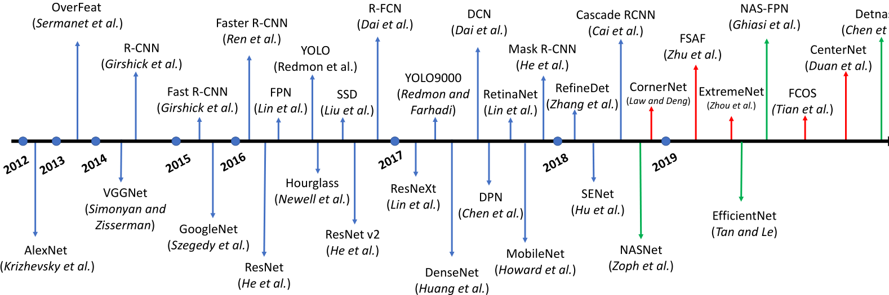
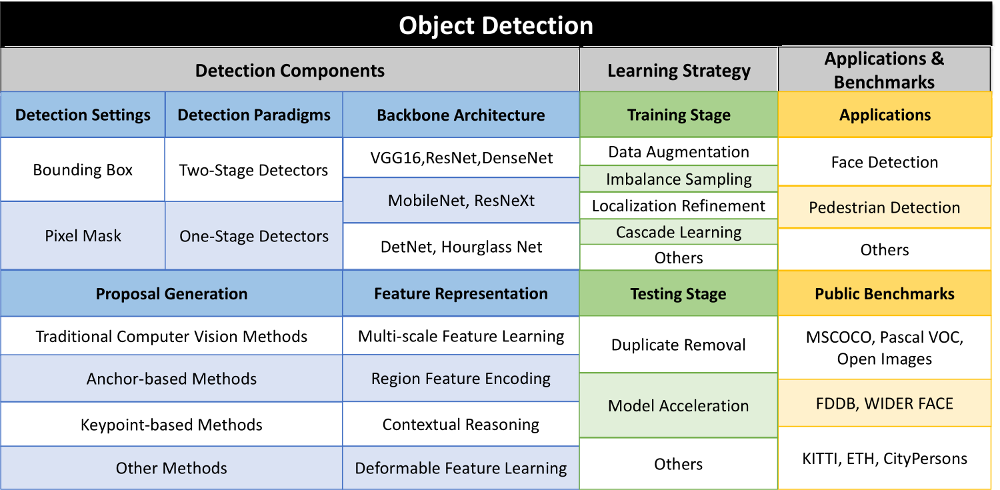
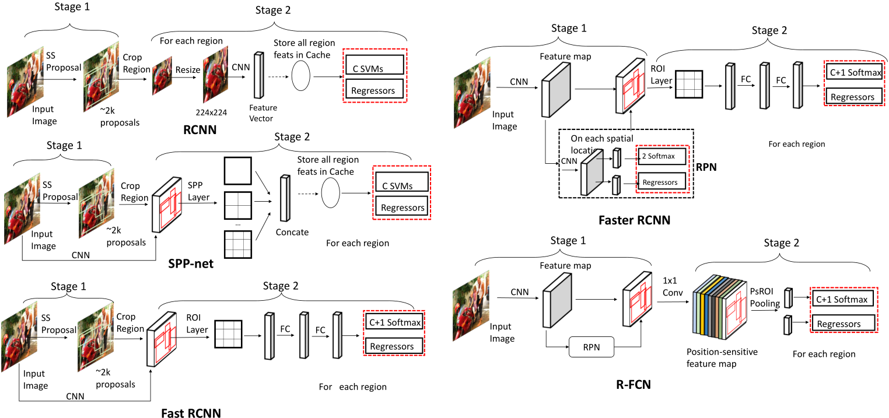

# 摘要
目标检测是计算机视觉中的一个基本视觉识别问题，在过去的几十年中得到了广泛的研究。视觉对象检测旨在在给定图像中找到具有精确定位的特定目标类的对象，并为每个对象实例分配一个相应的类标签。由于基于深度学习的图像分类的巨大成功，近年来使用深度学习的对象检测技术得到了积极的研究。在本文中，我们对深度学习视觉对象检测的最新进展进行了全面调查。通过回顾大量近期相关文献，我们系统地分析了现有的对象检测框架，并将调查分为三个主要部分：
- (i) 检测组件；
- (ii) 学习策略；
- (iii) 应用程序和基准测试。

在调查中，我们详细介绍了影响检测性能的各种因素，例如检测器架构、特征学习、建议框生成、采样策略等。最后，我们讨论了几个未来的方向，以促进和推动视觉对象检测的未来研究与深度学习。

关键词：对象检测，深度学习，深度卷积神经网络

# 1，介绍
在计算机视觉领域，有几个基本的视觉识别问题：图像分类、对象检测和实例分割和语义分割。特别是，图像分类旨在识别给定图像中对象的语义类别。对象检测不仅可以识别对象类别，还可以通过边界框预测每个对象的位置。语义分割旨在预测逐像素分类器，为每个像素分配一个特定的类别标签，从而提供对图像更丰富的理解。然而，与对象检测相反，语义分割不区分同一类别的多个对象。在对象检测和语义分割的交叉点上，提出了一种相对较新的设置，称为“实例分割”，用于识别不同的对象并为每个对象分配一个单独的分类像素级掩码。事实上，实例分割可以被视为对象检测的一种特殊设置，其中不需要通过边界框定位对象，而是需要像素级定位。在本次调查中，我们将注意力集中在回顾基于深度学习的对象检测方面的主要工作。一个好的检测算法应该对语义线索以及图像的空间信息有很强的理解。事实上，物体检测是许多计算机视觉应用的基本步骤，例如人脸识别，行人检测，视频分析和标志检测。

在早期，在深度学习时代之前，目标检测的流程分为三个步骤：i) 提议生成； ii) 特征向量提取；和 iii) 区域分类。在提议生成期间，目标是搜索图像中可能包含对象的位置。这些位置也称为感兴趣区域 (roi)。一个直观的想法是使用滑动窗口扫描整个图像。为了捕获有关对象的多尺度和不同纵横比的信息，将输入图像调整为不同的尺度，并使用多尺度窗口在这些图像中滑动。第二步，在图像的每个位置，从滑动窗口获得一个固定长度的特征向量，以捕获覆盖区域的判别语义信息。该特征向量通常由低级视觉描述符编码，例如 SIFT（尺度不变特征变换）、Haar、HOG（梯度直方图）或 SURF（加速鲁棒特征），这对尺度、光照和旋转方差表现出一定的鲁棒性。最后，在第三步中，学习区域分类器为覆盖区域分配分类标签。通常，这里使用支持向量机（SVM），因为它们在小规模训练数据上表现良好。此外，在区域分类步骤中使用了一些分类技术，如bagging、级联学习和 adaboost，从而进一步提高了检测精度。

大多数成功的传统目标检测方法都专注于精心设计特征描述符以获得感兴趣区域的嵌入。借助良好的特征表示和稳健的区域分类器，在 Pascal VOC 数据集（用于基准对象检测的公开可用数据集）上取得了令人印象深刻的结果。值得注意的是，基于可变形部件的机器 (DPM) 是一种突破性的检测算法，在 2007、2008 和 2009 年的 VOC 挑战赛中三度获胜。DPM 学习并集成具有可变形损失的多个部件模型，并使用用于判别训练的潜在 SVM。然而，在 2008 年到 2012 年期间，基于这些传统方法的 Pascal VOC 的进展变得渐进式，从构建复杂的集成系统中获得了微小的收益。这显示了这些传统探测器的局限性。最突出的是，这些限制包括：（i）在提案生成期间，生成了大量提案，其中许多是多余的；这导致分类期间出现大量误报。而且，窗口比例尺是手动设计的，启发式设计的，不能很好地匹配对象； (ii) 特征描述符是基于低级视觉线索手工制作的，这使得很难在复杂的上下文中捕获代表性语义信息。 (iii) 检测流程的每一步都是单独设计和优化的，因此无法获得整个系统的全局最优解。

在成功应用深度卷积神经网络（DCNN）进行图像分类之后，基于深度学习技术的目标检测也取得了显着进展。新的基于深度学习的算法以巨大的优势超越了传统的检测算法。深度卷积神经网络是一种用于计算层次特征的受生物学启发的结构。 Fukushima 提出的“neocognitron”是为图像分类构建这种分层和空间不变模型的早期尝试。然而，这种早期的尝试缺乏有效的监督学习优化技术。基于这个模型，Lecun 等人通过反向传播通过随机梯度下降 (SGD) 优化卷积神经网络，并在数字识别方面表现出有竞争力的性能。然而，在那之后，深度卷积神经网络并没有被深入探索，支持向量机变得更加突出。这是因为深度学习有一些局限性：(i) 缺乏大规模带标注的训练数据，导致过拟合； (ii) 有限的计算资源； (iii) 与 SVM 相比，理论支持较弱。 2009 年，贾等人收集了一个包含 1.2M 高分辨率图像的大规模注释图像数据集 ImageNet，使得用大规模训练数据训练深度模型成为可能。随着并行计算系统（如 GPU 集群）上计算资源的发展，2012 年 Krizhevsky 等人使用 ImageNet 数据集训练了一个大型深度卷积模型，与所有其他方法相比，在大规模视觉识别挑战（ILSVRC）上显示出显着改进。在成功应用 DCNN 进行分类后，深度学习技术迅速适应了其他视觉任务，并且与传统方法相比显示出有希望的结果。

与传统检测器中使用的手工描述符相比，深度卷积神经网络生成从原始像素到高级语义信息的分层特征表示，这些特征表示是从训练数据中自动学习的，并在复杂的上下文中显示出更具辨别力的表达能力。 此外，得益于强大的学习能力，深度卷积神经网络可以在更大的数据集下获得更好的特征表示，而传统的视觉描述符的学习能力是固定的，无法在更多数据可用时提高。 这些特性使得设计基于深度卷积神经网络的目标检测算法成为可能，该算法可以端到端的方式进行优化，具有更强大的特征表示能力。

目前，基于深度学习的对象检测框架主要可以分为两大类：(i) 两阶段检测器，例如基于区域的 CNN (R-CNN)及其变体，(ii) 一级检测器，例如 YOLO及其变体。两阶段检测器首先使用提议生成器生成一组稀疏提议并从每个提议中提取特征，然后是区域分类器预测提议区域的类别。一级检测器直接对特征图的每个位置上的对象进行分类预测，而无需级联区域分类步骤。两级检测器通常可以实现更好的检测性能并在公共基准上报告最先进的结果，而一级检测器的时间效率明显更高，并且对实时对象检测具有更大的适用性。

本文是全面了解基于深度学习的对象检测算法。我们回顾了基于深度学习的对象检测的各种贡献，并将它们分为三组：检测组件、学习策略以及应用程序和基准。对于检测组件，我们首先介绍两个检测设置：边界框级别（bbox-level）和像素掩码级别（mask-level）定位。 Bbox 级算法需要通过矩形边界框来定位对象，而在掩码级算法中需要更精确的像素级掩码来分割对象。接下来，我们总结了两个检测家族的代表性框架：两阶段检测和一阶段检测。然后我们对每个检测组件进行了详细调查，包括主干架构、提议生成和特征学习。对于学习策略，由于训练检测器的难度，我们首先强调了检测学习策略的重要性，然后详细介绍了训练和测试阶段的优化技术。最后，我们回顾了一些基于现实世界物体检测的应用，包括人脸检测、行人检测、标志检测和视频分析。我们还讨论了这些检测任务的公开可用和常用的基准和评估指标。最后，我们展示了近年来在公共基准上进行通用检测的最新成果。

我们希望本文能够为研究人员和从业人员提供及时的回顾，以进一步促进对检测系统的研究。 论文的其余部分组织如下：
- 在第 2 节中，我们给出了目标检测的标准问题设置；
- 第 3 节列出了检测器组件的详细信息；
- 第 4 节介绍了学习策略；
- 第 5 节和第 6 节提供了用于实际应用和基准的检测算法；
- 第 7 节列出了通用检测；
- 最后，我们在第 8 节总结和讨论未来的方向。

# 2，标准问题设置
在本节中，我们提出了基于深度学习的对象检测的正式问题设置。 对象检测涉及识别（例如，“对象分类”）和定位（例如，“位置回归”）任务。 对象检测器需要通过精确定位和对每个对象实例的正确分类标签预测，将某些目标类别的对象与图像中的背景区分开来，预测边界框或像素掩码以定位这些目标对象实例。

更一般的，若有N个带标注的图片${x_{1}, x_{2}...x_{N}}$，对第$i^{th}$张图片$x_{i}$，有$M_{i}$个物体属于C个类别，记作：
$$y_{i} = {(c^{i}_{1}, b^{i}_{1}),(c^{i}_{2}, b^{i}_{2})...(c^{i}_{i}, b^{i}_{i})}$$
其中$c^{i}_{j} \in C$代表类别，$b^{i}_{j}$代表$x_{i}$图片中第$j$个对象的空间坐标。检测器$f$可由$\theta$参数化，即对于$x_{i}$，推理结果与$y_{i}$的形式相同：
$$y^{i}_{pred} = {(c^{i}_{pred_{1}}, b^{i}_{pred_{1}}),(c^{i}_{pred_{2}}, b^{i}_{pred_{2}})...}$$
所以损失函数就是优化下列检测器：
$$l(x,\theta) = \frac{1}{N}\sum^{N}_{i=1}l(y^{i}_{pred}, x_{i}, y_{i};\theta)+\frac{\lambda}{2}||\theta ||^{2}_{2}$$
其中，第二项是带参数的归一化项，不同的loss函数有不同的侧重点，这块将在第4部分讲解。

在进行指标评价时，有一个变量经常用到，就是bbox和gt之间的IoU值，其定义如下：
$$IoU(b_{pred}, g_{gt}) =  \frac{Area(b_{pred}\cap b_{gt})}{Area(b_{pred}\cup b_{gt})}$$
推理中应用的IoU方式一般为：
$$Prediction = \begin{cases} Positive & c_{pred} = c_{gt} \, and\, IoU(b_{pred},b_{gt})>\omega \\ Negative & othersize \end{cases}$$

对于通用对象检测问题评估，使用 C 类上的平均精度 (mAP) 进行评估，并且在行人检测等实际场景中，使用不同的评估指标，这将在第 5 节中讨论。除了检测准确性，推理速度也是评估对象检测算法的重要指标。具体来说，如果我们希望检测视频流中的物体（实时检测），就必须有一个能够快速处理这些信息的检测器。 因此，检测器的效率也是根据每秒帧数 (FPS) 来评估的，即每秒可以处理多少图像。 通常可以达到 20 FPS 推理速度的检测器被认为是实时检测器。

# 3，检测组件
在本节中，我们将介绍对象检测的不同组件。 首先是关于对象检测范式的选择。 我们首先介绍两种检测设置的概念：bbox 级和掩码级算法。 然后，我们介绍两种主要的物体检测范式：两级检测器和一级检测器。 在这些范式下，检测器可以使用各种深度学习主干架构、提议生成器和特征表示模块。

## 3.1 检测设置
对象检测有两种设置：
- i）普通对象检测（bbox 级定位）
- ii）实例分割（像素级或掩码级定位）。 

Vanilla 对象检测已得到更广泛的研究，被认为是传统的检测设置，其目标是通过矩形边界框定位对象。在vanilla 目标检测算法中，只需要bbox标注框，并且在评估中，计算预测的bbox与gt之间的IoU来衡量性能。实例分割是一个相对较新的设置，基于传统的检测设置。实例分割需要通过像素级掩码而不是粗略的矩形边界框来分割每个对象。由于更精确的像素级预测，实例分割对空间错位更敏感，因此对处理空间信息的要求更高。实例分割的评估指标几乎与 bbox 级检测相同，除了 IoU 计算是在掩码预测上执行的。虽然这两个检测设置略有不同，但后面介绍的主要组件大多可以由这两个设置共享。

## 3.2 检测算法路线
当前最先进的深度学习目标检测器主要可以分为两大类：两级检测器和一级检测器。对于两阶段检测器，在第一阶段，生成一个稀疏的提议集；在第二阶段，生成的提议的特征向量由深度卷积神经网络编码，然后进行对象类别预测。一级检测器没有单独的提议生成阶段（或学习提议生成）。他们通常将图像上的所有位置都视为潜在对象，并尝试将每个感兴趣的区域分类为背景或目标对象。两阶段检测器经常在许多公共基准数据集上报告最先进的结果。然而，它们通常在较低的推理速度方面存在不足。一级检测器在实时物体检测应用中速度更快，更受欢迎，但与二级检测器相比，其性能相对较差。

### 3.2.1 二阶段检测算法
两阶段检测器将检测任务分为两个阶段：（i）提议生成； (ii) 对这些提议进行预测。 在提议生成阶段，检测器将尝试识别图像中可能是对象的区域。 这个想法是提出具有高召回率的区域，使得图像中的所有对象至少属于这些提议区域中的一个。 在第二阶段，基于深度学习的模型用于使用正确的分类标签对这些建议进行分类。 该区域可以是背景，也可以是来自预定义类标签之一的对象。 此外，该模型可以改进提案生成器建议的原始定位。 接下来，我们回顾了两阶段检测器中一些最有影响力的工作。

**R-CNN** 是 Girshick 等人提出的开创性的两阶段目标检测器。在 2014 年。 与之前基于传统检测框架 SegDPM 的最先进方法相比，Pascal VOC2010 上的 mAP 为 40.4%，R-CNN 显着提高了检测性能并获得了 53.7% 的 mAP。R-CNN 的管道可以分为三个部分：i) 提议生成，ii) 特征提取和 iii) 区域分类。对于每张图像，R-CNN 通过选择性搜索生成一组稀疏的提议（大约 2,000 个提议），旨在拒绝可以轻松识别为背景区域的区域。然后，每个提议被裁剪并调整为固定大小的区域，并由深度卷积神经网络编码为（例如 4,096 维）特征向量，然后是一对多 SVM 分类器。最后，使用提取的特征作为输入来学习边界框回归器，以使原始提议紧密地绑定对象。与传统的手工特征描述符相比，深度神经网络生成分层特征并捕获不同层的不同尺度信息，最终产生用于分类的鲁棒性和判别性特征。利用迁移学习的力量，R-CNN 采用在 ImageNet 上预训练的卷积网络的权重。为检测任务重新初始化最后一个全连接层（FC 层）。然后在预训练模型上对整个检测器进行微调。这种来自 Imagenet 数据集的知识转移提供了显着的性能提升。此外，R-CNN 在训练前拒绝了大量的简单否定，这有助于提高学习速度并减少误报。

然而，R-CNN 面临一些严重的缺点：i）每个提议的特征都是由深度卷积网络单独提取的（即计算不共享），这导致了大量重复的计算。 因此，R-CNN 的训练和测试非常耗时； ii）R-CNN的三个步骤（提议生成、特征提取和区域分类）是独立的组成部分，整个检测框架不能以端到端的方式进行优化，难以获得全局最优解 ; iii) 选择性搜索依赖于低级别的视觉线索，因此难以在复杂的上下文中生成高质量的建议。 此外，它无法享受到的好处
GPU加速。

受到空间金字塔匹配（SPM）思想的启发，何凯明等人提出了 SPP-net 来加速 R-CNN 并学习更多的判别特征。 SPP-net 不是单独裁剪提议区域并输入 CNN 模型，而是使用深度卷积网络从整个图像计算特征图，并通过空间金字塔池化 (SPP) 层在特征图上提取固定长度的特征向量. SPP将特征图划分成一个N×N的网格，对于N的多个值（从而允许在不同尺度上获取信息），并对网格的每个单元进行池化，给出一个特征向量。从每个 N × N 网格获得的特征向量被连接起来以给出该区域的表示。提取的特征被送入区域 SVM 分类器和边界框回归器。与 RCNN 相比，SPP 层还可以在不同尺度和纵横比的图像/区域上工作，而无需调整它们的大小。因此，它不会受到信息丢失和不需要的几何失真的影响。

与 R-CNN 相比，SPP-net 取得了更好的结果，并且具有明显更快的推理速度。然而，SPP-net 的训练仍然是多阶段的，因此无法进行端到端的优化（并且需要额外的缓存来存储提取的特征）。此外，SPP 层没有将梯度反向传播到卷积核，因此 SPP 层之前的所有参数都被冻结。这极大地限制了深度骨干架构的学习能力。吉尔希克等人提出了 Fast R-CNN，这是一种多任务学习检测器，解决了 SPP-net 的这两个局限性。 Fast R-CNN（如 SPP-Net）也为整个图像计算了一个特征图，并在特征图上提取了固定长度的区域特征。与 SPP-net 不同，Fast R-CNN 使用 ROI Pooling 层来提取区域特征。 ROI 池化层是 SPP 的一个特例，它只需要一个尺度（即 N × N 网格只有一个 N 值）将提议划分为固定数量的分区，并将误差信号反向传播到卷积核。在特征提取之后，特征向量被输入到两个兄弟输出层之前的一系列全连接层：分类层（cls）和回归层（reg）。分类层负责生成 C+1 类（C 类加一个背景类）的 softmax 概率，而回归层编码 4 个实值参数以细化边界框。在 Fast RCNN 中，特征提取、区域分类和边界框回归步骤都可以端到端优化，无需额外的缓存空间来存储特征（与 SPP Net 不同）。 Fast R-CNN 实现了比 R-CNN 和 SPP-net 更好的检测精度，并且具有更好的训练和推理速度。

尽管在学习检测器方面取得了进展，但提案生成步骤仍然依赖于传统方法，如选择性搜索或边缘框，这些方法基于低级视觉线索，无法在数据驱动的方式。为了解决这个问题，开发了 Faster R-CNN，它依赖于一种新颖的提议生成器：区域提议网络（RPN）。这个提议生成器可以通过监督学习方法来学习。 RPN 是一个完全卷积的网络，它采用任意大小的图像并在特征图的每个位置生成一组对象提议。网络使用 n × n 滑动窗口在特征图上滑动，并为每个位置生成一个特征向量。然后将特征向量送入两个兄弟输出分支，对象分类层（对提议是否为对象进行分类）和边界框回归层。然后将这些结果输入到最后一层，用于实际的对象分类和边界框定位。 RPN 可以插入到 Fast R-CNN 中，因此整个框架可以在训练数据上以端到端的方式进行优化。通过这种方式，RPN 能够以数据驱动的方式生成提议，并且还能够享受深层主干网络的判别能力。 Faster R-CNN 能够在 GPU 上以 5FPS 进行预测，并在许多公共基准数据集上取得了最先进的结果，例如 Pascal VOC 2007、2012 和 MSCOCO。目前，有大量基于 Faster R-CNN 的检测器变体，用于不同的用途。

Faster R-CNN 计算输入图像的特征图并提取特征图上的区域特征，跨不同区域共享特征提取计算。然而，计算并未在区域分类步骤中共享，其中每个特征向量仍然需要分别通过一系列 FC 层。这种额外的计算可能非常大，因为每个图像可能有数百个提议。简单地去除全连接层会导致检测性能的急剧下降，因为深度网络会减少建议的空间信息。戴等人提出了基于区域的全卷积网络（R-FCN），它在区域分类步骤中分担了计算成本。 R-FCN生成一个Position Sensitive Score Map，对不同类别的相对位置信息进行编码，并使用Position Sensitive ROI Pooling layer（PSROI Pooling）通过对目标区域的每个相对位置进行编码来提取空间感知区域特征。提取的特征向量保留了空间信息，因此与没有区域全连接层操作的 Faster R-CNN 相比，检测器取得了有竞争力的结果。

Faster R-CNN 的另一个问题是它使用单个深层特征图来进行最终预测。这使得检测不同尺度的物体变得困难。特别是，很难检测到小物体。在 DCNN 特征表示中，深层特征语义强但空间弱，而浅层特征语义弱但空间强。林等人利用这一特性并提出了特征金字塔网络（FPN），该网络将深层特征与浅层特征相结合，以在不同尺度的特征图中实现对象检测。主要思想是通过来自更深层的丰富语义信息来加强空间强的浅层特征。 FPN 在检测多尺度对象方面取得了重大进展，并已广泛应用于许多其他领域，如视频检测和人体姿势识别。

大多数实例分割算法都是从普通对象检测算法扩展而来的。早期的方法通常生成分段建议，然后是用于分段分类的 Fast RCNN。后来，戴等人提出了一种名为“MNC”的多阶段算法，它将整个检测框架分为多个阶段，并从学习到的边界框建议中预测分割掩码，然后由区域分类器进行分类。这些早期的作品在多个阶段进行了 bbox 和 mask 预测。为了使整个过程更加灵活，He等人提出了 Mask R-CNN，它根据建议并行预测边界框和分割掩码，并报告了最先进的结果。 Huang等人基于Mask R-CNN提出了一个掩码质量感知框架，称为掩码评分 R-CNN，它学习了预测掩码的质量并校准了掩码质量和掩码置信度分数之间的错位。

### 3.2.2 一阶段算法
与两阶段检测算法不同，两阶段检测算法将检测管道分为两部分：提议生成和区域分类；一级检测器没有单独的提案生成阶段（或学习提案生成）。他们通常将图像上的所有位置都视为潜在对象，并尝试将每个感兴趣的区域分类为背景或目标对象。

早期成功的基于深度学习的单级检测器之一是由 Sermanet 等人开发的，命名为 Over-Feat。 OverFeat 通过将 DCNN 分类器转换为完全卷积的对象检测器来执行对象检测。对象检测可以被视为“多区域分类”问题，因此 OverFeat 通过将最后的 FC 层视为 1x1 卷积层以允许任意输入将原始分类器扩展为检测器。分类网络输出对输入的每个区域的预测网格，以指示对象的存在。在识别对象后，学习边界框回归器以基于分类器的相同 DCNN 特征来细化预测区域。为了检测多尺度对象，将输入图像调整为多个尺度，然后输入网络。最后，将所有尺度的预测合并在一起。通过使用卷积层共享重叠区域的计算，与 RCNN 相比，OverFeat 显示出显着的速度强度，并且只需要通过网络向前传递一次。然而，分类器和回归器的训练是分开的，没有联合优化。

后来，雷德蒙等人开发了一种名为 YOLO（你只看一次）的实时检测器。 YOLO 将对象检测视为回归问题，并将整个图像在空间上划分为固定数量的网格单元（例如使用 7 × 7 网格）。每个单元格都被认为是检测压力的提议
一个或多个对象。在最初的实现中，每个单元格都被认为包含（最多）两个对象的中心。对于每个单元格，进行了包含以下信息的预测：该位置是否有对象、边界框坐标和大小（宽度和高度）以及对象的类别。整个框架是一个单一的网络，它省略了可以以端到端方式优化的提案生成步骤。基于精心设计的轻量级架构，YOLO 可以在 45 FPS 时进行预测，并通过更简化的主干达到 155 FPS。然而，YOLO 面临一些挑战：i）它在给定位置最多只能检测两个物体，这使得检测小物体和拥挤的物体变得困难。 ii) 仅使用最后一个特征图进行预测，不适合在多尺度和长宽比下预测对象。

